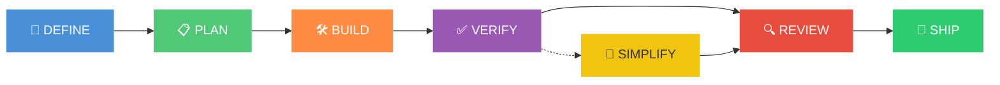
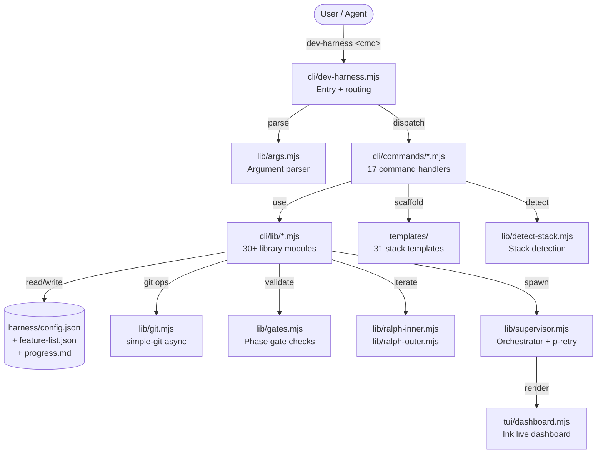
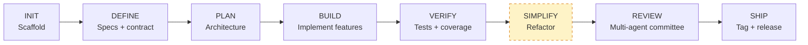
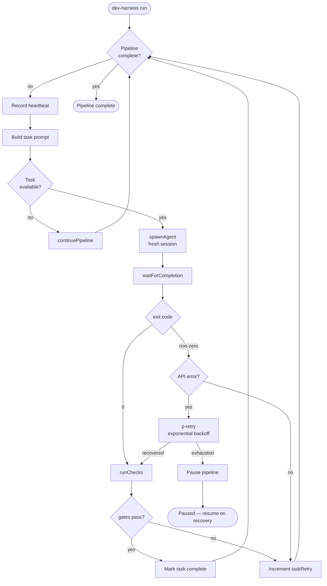
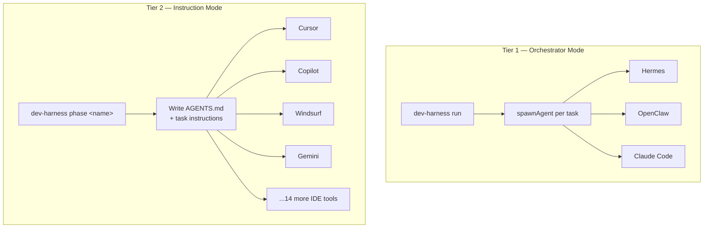

<div align="center">

# 🎯 Dev Harness

### *Agent-Agnostic Development Pipeline CLI*

**Scaffold · Phase Orchestration · Gate Validation · Iterative Refinement**

[](https://www.npmjs.com/package/dev-harness-cli)
[](https://opensource.org/licenses/MIT)
[](https://nodejs.org)
[](#-dependencies)
[](#)
[](#)

🧰 **Works with any coding agent — IDE or TUI**

`Claude Code` · `Cursor` · `Windsurf` · `GitHub Copilot` · `Gemini CLI` · `Codex CLI` · `Cline` · `Roo Code` · `Kilo Code` · `Amazon Q Developer` · `OpenCode` · `Continue` · `Aider` · `Hermes` · `OpenClaw` · `Antigravity` · `Pi` · and more

</div>

---

## 📋 Table of Contents

- [🤔 What Is This?](#-what-is-this)
- [🚀 Quick Start](#-quick-start)
- [📖 User Guide](#-user-guide)
  - [🖥️ IDE-Based Agentic Tools](#️-ide-based-agentic-tools)
  - [💻 TUI-Based Agentic Tools](#-tui-based-agentic-tools)
- [🧠 How It Works](#-how-it-works)
  - [Pipeline Phases](#pipeline-phases)
  - [Gate Validation](#gate-validation)
  - [Ralph Inner / Outer Loops](#ralph-inner--outer-loops)
  - [Multi-Agent Committee Review](#multi-agent-committee-review)
  - [🖥️ Live TUI Dashboard](#️-live-tui-dashboard)
- [📁 Project Structure](#-project-structure)
- [⚙️ CLI Reference](#️-cli-reference)
- [🔧 Configuration](#-configuration)
- [📤 JSON Output](#-json-output)
- [🙏 Acknowledgements & Influences](#-acknowledgements--influences)
- [📄 License](#-license)

---

## 🤔 What Is This?

**Dev Harness** is a CLI tool that brings **deterministic structure** to AI-assisted software development. Instead of ad-hoc prompting — where agents hallucinate scope, skip steps, or rubber-stamp their own work — Dev Harness enforces a **phase pipeline** with **gate validation**.

> 🎯 **Specs before code. Review before shipping. Nothing skipped.**



Each phase has **deterministic gates** — automated checks that must pass before the pipeline can advance. The agent does the work; the harness validates the result. No more wondering if the agent actually finished what it said it did.

### ✨ Key Features

| | Feature | Description |
|---|---------|-------------|
| 🧩 | **Agent-Agnostic** | Works with 18+ agentic coding tools — IDE extensions and TUI agents alike |
| 🚦 | **Phase Pipeline** | 7-phase workflow: Define → Plan → Build → Verify → Simplify → Review → Ship |
| 🚧 | **Gate Validation** | Every phase has deterministic pass/fail checks — no skipping steps |
| 🔄 | **Ralph Loops** | Inner/outer iterative loops with fresh-context retry (inspired by [ghuntley.com/ralph](https://ghuntley.com/ralph)) |
| 🧑‍⚖️ | **Multi-Agent Review** | Committee of agent personas (Planner, Generator, Evaluator, Simplifier) prevents self-evaluation leniency |
| 📝 | **Sprint Contracts** | Pre-build negotiation between agent personas for spec/code agreement |
| 🏗️ | **31+ Stack Templates** | Python, Node.js, Go, Rust, C, C++, Java, Kotlin, .NET, Ruby, PHP, Swift, Elixir, and many more |
| 🏭 | **Custom Stacks** | Unlimited custom language/platform support via `config.stackMeta` |
| 📦 | **Minimal Dependencies** | Curated runtime deps (ajv, simple-git, ink, p-retry, picocolors, string-width) — each chosen for a concrete robustness win |

---

## 🏗️ Architecture

Dev Harness is a layered CLI: argument parsing → command routing → library modules → file/state I/O. The diagrams below show how the pieces fit together.

### System Architecture



### 7-Phase Pipeline



> `SIMPLIFY` is opt-in (excluded from default phase order). Each phase has deterministic gate checks — no skipping.

### Ralph Inner/Outer Loop

The Ralph pattern drives iterative refinement. The **outer loop** advances phases; the **inner loop** iterates features/tasks within a phase, retrying with fresh git context on failure.

```mermaid
stateDiagram-v2
    [*] --> Idle
    Idle --> Running: phase &lt;name&gt;
    state Running {
        [*] --> LoadConfig
        LoadConfig --> CheckRetries
        CheckRetries --> Escalated: retries &gt;= max
        CheckRetries --> GitReset: retry &amp; --git-ops
        GitReset --> PickTask
        CheckRetries --> PickTask: fresh run
        PickTask --> FeatureIterate: build/verify/simplify
        PickTask --> DeliverableRetry: init/define/plan/review/ship
        FeatureIterate --> Instruction: next task
        DeliverableRetry --> Instruction: produce deliverable
        Instruction --> [*]: agent validates
    }
    Running --> Complete: all features pass
    Running --> Escalated: retries exhausted
    Complete --> [*]
    Escalated --> [*]
```

### Orchestrator (Supervisor) Data Flow

`dev-harness run` spawns an agent per task, monitors it, retries on API downtime, and renders a live dashboard.



### Tier-1 vs Tier-2 Agent Integration



> **Tier 1** tools are spawnable TUI agents — dev-harness runs them per task with fresh sessions and API retry. **Tier 2** tools are IDE extensions — dev-harness writes instructions and the agent reads them natively.

### 🖥️ Live TUI Dashboard

When you run `dev-harness run` in a terminal, dev-harness launches a **live split-pane TUI dashboard** (powered by [Ink](https://github.com/vadimdemedes/ink)):

```
┌─────────────────────────────────────────────────────────┐
│  🎯 Dev Harness — Pipeline Dashboard                     │
│                                                          │
│  Phases:  ✓ DEFINE  ✓ PLAN  ● BUILD  ○ VERIFY  ○ SHIP   │
│  Feature: auth-login (2/5 tasks)                         │
│  Task:    implement JWT validation                       │
│  Mode:    autopilot  |  Retries: 0/10  |  Iteration: 3  │
│ ─────────────────────────────────────────────────────── │
│  Agent Output                                            │
│  ● Spawning hermes for task: implement JWT validation    │
│  ✓ hermes completed task successfully.                   │
│  ✓ Task "jwt-validate" validated. Advancing.             │
│  ● Spawning hermes for task: add refresh token endpoint  │
│  ...                                                     │
│                                                          │
│  [p] pause  [r] resume  [q] quit  [Ctrl+C] safe exit    │
└─────────────────────────────────────────────────────────┘
```

- **Top pane** — persistent pipeline state: phases with checkmarks, current feature/task, mode, retry count, iteration
- **Bottom pane** — scrolling agent output (stdout streams here in real time)
- **Status bar** — keyboard controls + elapsed time

#### Starting the TUI

```bash
# TUI starts automatically when run in a terminal (TTY)
dev-harness run --agent-tool hermes

# Disable TUI — use one-shot text output instead (for logs/CI)
dev-harness run --agent-tool hermes --no-tui

# JSON output (no TUI, machine-parseable)
dev-harness run --agent-tool hermes --json
```

> **Automatic fallback:** If stdout is not a TTY (e.g. piped to a file, run in CI), the TUI is skipped and dev-harness falls back to one-shot text rendering. `--json` and `--no-tui` also disable the TUI explicitly.

#### Keyboard Controls

| Key | Action |
|-----|--------|
| `p` | Pause the pipeline (saves state — resume with `dev-harness resume`) |
| `r` | Resume the pipeline (unpauses in-place) |
| `q` / `Esc` | Quit the dashboard (pipeline pauses safely) |
| `Ctrl+C` | Safe exit — pauses pipeline, saves state, exits cleanly |

> **Safe exit:** Quitting via `q` or `Ctrl+C` does **not** lose progress — the pipeline state is saved to `harness/config.json` (`paused: true`), and you can resume with `dev-harness resume` followed by `dev-harness run`.

---

## 🚀 Quick Start

```bash
# 🏁 One-liner — no install needed
npx dev-harness-cli init --stack python --target my-project

# 📦 Global install
npm install -g dev-harness-cli
dev-harness --help
```

> **Requires Node.js >= 18.** Minimal, audited runtime dependencies.

### Your First Pipeline

```bash
# 1️⃣ Scaffold a new project
dev-harness init --stack node --target my-app
cd my-app

# 2️⃣ Check your status
dev-harness status

# 3️⃣ Run the DEFINE phase (agent writes specs)
dev-harness phase define

# 4️⃣ Validate — run gate checks
dev-harness validate

# 5️⃣ Advance through the pipeline
dev-harness phase plan
dev-harness phase build
dev-harness phase verify
dev-harness phase review
dev-harness phase ship
```

---

## 📖 User Guide

Dev Harness works with two families of agentic coding tools. Which one are you using?

---

### 🖥️ IDE-Based Agentic Tools

These tools run as **extensions or built-in features inside an editor/IDE** (VS Code, JetBrains, etc.). They read a project-level config file to understand how to behave.

#### How It Works

1. **Scaffold** with the `--agent-tool` flag for your tool
2. Dev Harness generates the **tool-specific config file** that the agent reads automatically
3. The agent follows the **phase instructions** emitted by `dev-harness phase <name>`
4. After each phase, run `dev-harness validate` to **check gates** before advancing

#### Supported IDE Tools

| Tool | Config File | Init Command |
|------|-------------|-------------|
| **Claude Code** | `CLAUDE.md` | `dev-harness init --agent-tool claude-code` |
| **Cursor** | `.cursorrules` | `dev-harness init --agent-tool cursor` |
| **Windsurf** | `.windsurfrules` | `dev-harness init --agent-tool windsurf` |
| **GitHub Copilot** | `.github/copilot-instructions.md` | `dev-harness init --agent-tool copilot` |
| **Gemini CLI** | `GEMINI.md` | `dev-harness init --agent-tool gemini` |
| **Codex CLI** | `AGENTS.md` | `dev-harness init --agent-tool codex` |
| **Cline** | `.clinerules` | `dev-harness init --agent-tool cline` |
| **Roo Code** | `.roorules` | `dev-harness init --agent-tool roo` |
| **Kilo Code** | `.kilocoderules` | `dev-harness init --agent-tool kilo-code` |
| **Amazon Q Developer** | `.amazonq/rules.md` | `dev-harness init --agent-tool amazon-q` |
| **OpenCode** | `AGENTS.md` | `dev-harness init --agent-tool opencode` |
| **Continue** | `AGENTS.md` | `dev-harness init --agent-tool continue` |
| **Aider** | `AGENTS.md` | `dev-harness init --agent-tool aider` |

#### IDE Setup Example — Claude Code

```bash
# Scaffold with Claude Code adapter
dev-harness init --stack python --agent-tool claude-code --target my-project
cd my-project

# CLAUDE.md is now in the project root — Claude reads it automatically
claude

# Inside Claude: follow the phase instructions
# "Run: dev-harness phase define"
# "Run: dev-harness validate"
# "Run: dev-harness phase plan"
# ...and so on through the pipeline
```

> **Pattern:** All IDE tools follow the same workflow — scaffold with the tool flag, then let the agent read its config and follow phase instructions. The only difference is which filename the agent expects.

---

### 💻 TUI-Based Agentic Tools

These tools run as **standalone terminal applications** (TUI = Terminal User Interface). They typically read `AGENTS.md` from the project root natively, or use a custom manifest format.

#### How It Works

1. **Scaffold** with `--agent-tool` for your TUI tool (or use `generic`)
2. The harness generates `AGENTS.md` — the canonical conventions file
3. The TUI agent reads `AGENTS.md` on startup and follows the pipeline
4. Full adapter directories may include **wrapper scripts** that delegate to the CLI

#### Supported TUI Tools

| Tool | Entry Point | Init Command | Notes |
|------|------------|-------------|-------|
| **Hermes** | `adapters/hermes/SKILL.md` | `dev-harness init --agent-tool hermes` | Full adapter with SKILL.md manifest + wrapper scripts |
| **OpenClaw** | `AGENTS.md` | `dev-harness init --agent-tool openclaw` | Reads AGENTS.md natively |
| **Antigravity** | `AGENTS.md` | `dev-harness init --agent-tool antigravity` | Reads AGENTS.md natively |
| **Pi** | `AGENTS.md` | `dev-harness init --agent-tool pi` | Reads AGENTS.md natively |
| **Generic** | `AGENTS.md` | `dev-harness init --agent-tool generic` | Fallback — works with any tool |

#### TUI Setup Example — Hermes

```bash
# Scaffold with Hermes adapter
dev-harness init --stack go --agent-tool hermes --target my-service
cd my-service

# Hermes loads the skill via adapters/hermes/SKILL.md
# The SKILL.md references wrapper scripts that call the CLI
# adapters/hermes/
#   ├── SKILL.md           ← Hermes skill manifest
#   ├── scripts/
#   │   ├── init.mjs       ← Wraps dev-harness init
#   │   ├── phase.mjs      ← Wraps dev-harness phase
#   │   └── validate.mjs   ← Wraps dev-harness validate
#   └── templates/         ← Shared templates

# Follow the phase pipeline inside Hermes
```

> **Pattern:** TUI tools that natively read `AGENTS.md` need no extra config — just scaffold and go. Tools with custom manifest formats (like Hermes with `SKILL.md`) get a full adapter directory with wrapper scripts.

---

## 🧠 How It Works

### Pipeline Phases

| Phase | 🎯 Goal | 📦 Key Artifact | 🚧 Gate(s) |
|-------|---------|-----------------|------------|
| 🔵 **DEFINE** | Write specs before any code | `SPEC.md`, `PROJECT_PLAN.md` | `feature-branch`, `contract-agreed` |
| 🟢 **PLAN** | Break specs into actionable tasks | Task breakdown | `git-clean` |
| 🟠 **BUILD** | Implement features one at a time | Working code | `coverage` _(if enabled)_ |
| 🟣 **VERIFY** | Validate and test everything | Passing test suite | `coverage` _(if enabled)_ |
| 🟡 **SIMPLIFY** | Refactor, reduce complexity | Cleaner codebase | `git-clean`, `no-empty-dirs` |
| 🔴 **REVIEW** | Multi-agent committee review | Review report | `branch-up-to-date`, `rubric-exists`, `readme-exists`, `architecture-doc`, `decisions-logged` |
| 🟢 **SHIP** | Tag, changelog, publish | Release | `git-clean`, `tagged`, `changelog`, `readme-exists`, `license-exists`, `changelog-content`, `contributing-exists`, `no-empty-dirs` |

> 🧹 **SIMPLIFY** is optional — it runs after VERIFY only if `simplify` is in your phase list.

### Gate Validation

Every phase has **deterministic gates** — automated checks that return a clear **pass/fail**. Gates prevent the most common failure modes in AI-assisted development:

- 🚫 **No skipping** — can't ship without reviewing
- 📝 **No coding without specs** — DEFINE gates must pass before BUILD
- 🔍 **No self-review leniency** — REVIEW uses multi-agent committee
- 🧹 **No dead code or empty dirs** — SIMPLIFY gates keep the codebase clean

Enable gates:

```bash
dev-harness config set gates.enabled true
```

### Ralph Inner / Outer Loops

The architecture is built on the **Ralph pattern** — an iterative loop architecture that gives the agent fresh context on each retry.

```
┌──────────────────────────────────────────────────────────┐
│                    🌐 OUTER LOOP                         │
│  define → plan → build → verify → review → ship         │
│  (phase transitions, gate validation, human escalation)  │
└──────────────────────┬───────────────────────────────────┘
                       │
                       ▼
┌──────────────────────────────────────────────────────────┐
│                    🔄 INNER LOOP                         │
│                                                          │
│  feature-iterate mode:                                   │
│    pick next feature → agent works → validate → pass?    │
│      ✅ → next feature                                   │
│      ❌ → git reset --hard → retry (fresh context)       │
│                                                          │
│  deliverable-retry mode:                                 │
│    agent works on deliverable → validate → pass?         │
│      ✅ → advance phase                                  │
│      ❌ → rewrite + retry (up to N attempts)             │
│                                                          │
└──────────────────────────────────────────────────────────┘
```

#### 🌐 Outer Loop

The CLI **emits structured instructions** for the current phase. The agent executes the phase, then runs `dev-harness validate` — which checks phase-specific gates. If gates pass, the agent advances to the next phase.

#### 🔄 Inner Loop (Ralph)

When building or verifying, the harness enters an **inner loop** that iterates over individual features (`feature-iterate`) or retries failed deliverables (`deliverable-retry`). The critical insight: **on retry, the harness resets to a clean git state** (`git reset --hard` + clean). This forces the agent to re-approach the problem with fresh context — avoiding the common failure mode of compounding its own mistakes.

> 💡 *"The single most important implementation detail is the hard reset on retry — it forces the agent to re-approach the problem rather than patch around its own bugs."*

### Multi-Agent Committee Review

During REVIEW, Dev Harness can orchestrate a **committee of agent personas** — each reviewing from a different perspective:

| Persona | Role |
|---------|------|
| 🧭 **Planner** | Does this meet the spec? Is the architecture sound? |
| ⚙️ **Generator** | Does the code work? Is it idiomatic? |
| 🔍 **Evaluator** | What's wrong? Where are the gaps? _(tuned to be skeptical)_ |
| 🧹 **Simplifier** | Is this over-engineered? Can it be simpler? |

This directly addresses the **self-evaluation leniency problem** — an agent asked to review its own work will almost always rubber-stamp it. A separate Evaluator persona, tuned to be skeptical, catches what the Generator misses.

---

## 📁 Project Structure

When you run `dev-harness init`, all harness-managed files go into a `harness/` subfolder — keeping your project root clean:

```
my-project/
├── AGENTS.md                     # Agent conventions (root — tools expect it here)
├── .gitignore                    # Git ignore rules
├── package.json                  # Your project's package file
├── src/                          # Your source code
├── tests/                        # Your tests
└── harness/                      # All harness-managed files
    ├── config.json               # Harness configuration + state
    ├── progress.md               # Session state + lessons learned
    ├── sprint-contract.md        # Pre-build agreement
    ├── evaluator-rubric.md       # Quality scorecard
    ├── session-handoff.md        # Context for session transitions
    ├── clean-state-checklist.md  # Clean state checklist
    ├── features/
    │   ├── feature-list.json           # Feature tracking
    │   └── feature-list.schema.json    # Feature list schema
    ├── docs/
    │   ├── ARCHITECTURE.md             # Architecture decisions
    │   ├── CONSTRAINTS.md              # Technical constraints
    │   ├── DECISIONS.md                # Decision log
    │   ├── api-patterns.md             # API conventions
    │   ├── agents/                     # Agent role guides
    │   │   ├── planner.md
    │   │   ├── generator.md
    │   │   ├── evaluator.md
    │   │   └── simplifier.md
    │   └── phases/                     # Phase instructions
    │       ├── define.md
    │       ├── plan.md
    │       ├── build.md
    │       ├── verify.md
    │       ├── simplify.md
    │       ├── review.md
    │       └── ship.md
    ├── ci/
    │   ├── github-actions.yml
    │   └── gitlab-ci.yml
    └── scripts/
        ├── init.sh
        └── init.ps1
```

---

## ⚙️ CLI Reference

| Command | Description |
|---------|-------------|
| `dev-harness init` | 🏗️ Scaffold a new harness project (stack + agent tool + target) |
| `dev-harness status` | 📊 Show current phase, stack, mode, and pipeline state |
| `dev-harness phase <name>` | 🚦 Run a pipeline phase (define, plan, build, verify, simplify, review, ship) |
| `dev-harness validate` | ✅ Run gate checks for the current phase |
| `dev-harness run` | 🚀 Start orchestrator — spawn agent per task, API retry, live dashboard |
| `dev-harness select-tool` | 🧰 Choose backend agentic tool (interactive wizard) |
| `dev-harness config [get|set|list]` | ⚙️ View or update configuration parameters |
| `dev-harness contract` | 📝 Negotiate a sprint contract between agent personas |
| `dev-harness checkpoint` | 💾 Create a manual git checkpoint |
| `dev-harness rollback` | ⏪ Roll back to a previous checkpoint |
| `dev-harness worktree` | 🌿 Manage git worktrees for parallel feature work |
| `dev-harness pause` | ⏸️ Pause the pipeline (save state) |
| `dev-harness resume` | ▶️ Resume a paused pipeline |
| `dev-harness set-mode <mode>` | 🔀 Switch between `copilot` (instruction) and `autopilot` (auto-advance) |
| `dev-harness learn` | 📚 Mark a phase as learned (skip in future runs) |
| `dev-harness detect-tool` | 🔎 Auto-detect which agent tool is in use |
| `dev-harness --help` | ❓ Show full help |

---

## 🔧 Configuration

All configuration lives in `harness/config.json`. View with:

```bash
dev-harness config list
```

<details>
<summary>📋 Click to see configuration groups</summary>

| Group | Parameters | Description |
|-------|-----------|-------------|
| ⚡ **Execution** | `mode`, `paused`, `maxRetries`, `taskRetryCount` | Runtime behavior + retry state |
| 🏗️ **Stack** | `stack`, `stackMeta` | Language/platform configuration |
| 🧰 **Agent Tool** | `agentTool` | Current agent tool selection |
| 🚧 **Gates** | `gates.enabled`, `gates.checks`, `gates.coverage.enabled`, `gates.coverage.threshold` | Gate validation settings |
| 🌿 **Git** | `git.autoCommit`, `git.autoTag`, `git.resetOnRetry` | Git integration behavior |
| 🚦 **Phases** | `phases.enabled` | Pipeline phase configuration |
| 🎭 **Agent Tones** | `agents.tone.planner`, `agents.tone.generator`, `agents.tone.evaluator`, `agents.tone.simplifier` | Persona instruction customization |
| 💾 **Runtime State** | `currentPhase`, `retryCount`, `pipelineIteration`, `gateHistory`, `features.*`, `git.branch`, `git.clean`, `git.hasUpstream`, `git.lastCommitMessage` | Live pipeline state (read-only) |

</details>

**29 parameters** across 8 groups. See [docs/CONFIGURATION.md](docs/CONFIGURATION.md) for the full reference.

---

## 📤 JSON Output

All commands support `--json` for machine-parseable output — perfect for CI/CD pipelines, wrapper scripts, and tool integration.

```bash
dev-harness status --json
dev-harness phase define --json
dev-harness validate --json
```

```json
{
  "command": "status",
  "status": "ok",
  "currentPhase": "define",
  "stack": "node",
  "mode": "copilot"
}
```

| Convention | Rule |
|------------|------|
| ✅ **stdout** | Always valid JSON — machine-parseable, no exceptions |
| ❌ **stderr** | All errors (JSON errors included) — stdout stays parseable on failure |
| **Exit codes** | `0` success, `1` validation failure, `2` usage error, `3` internal error |
| **JSON contract** | Every response includes `command`, `status`, `message` |

> **v2.2.0:** JSON errors now go to **stderr** (previously stdout), and all command handlers exit with the correct non-zero code on failure — making `--json` output reliably parseable in CI/scripting on both success and error paths.

---

## � Dependencies

Dev Harness v2.1.0 moved from zero-runtime-deps to a **minimal, audited** dependency set. Each dependency was chosen for a concrete robustness, performance, or correctness win that the hand-rolled equivalent could not match. All dependencies are ubiquitous, well-maintained, and support Node 18+.
> **v2.2.0** added no new dependencies — the release was an internal consolidation refactor (output/error layers, exit-code fixes, dead code removal). The dependency set below is unchanged from v2.1.0.
| Dependency | Version | Replaces | Why |
|------------|---------|----------|-----|
| [`ajv`](https://github.com/ajv-validator/ajv) | ^8 | hand-rolled `validate-schema.mjs` | Full JSON Schema draft-07 support (`$ref`, `format`, `oneOf`, `if/then/else`, `pattern`) — the previous validator silently passed configs using unsupported keywords |
| [`simple-git`](https://github.com/steveukx/git-js) | ^3 | `execSync`-based `git.mjs` | **Async** git ops — unblocks the orchestrator event loop during `dev-harness run`; typed results; eliminates string-concat command injection risk |
| [`ink`](https://github.com/vadimdemedes/ink) + [`react`](https://react.dev) | ^5 / ^18 | manual ANSI `tui/dashboard.mjs` | Real layout engine, proper Unicode width, focus management, scrollable regions that work across terminals |
| [`p-retry`](https://github.com/sindresorhus/p-retry) | ^6 | hand-rolled backoff in `supervisor.mjs` | Battle-tested exponential backoff with `shouldRetry` predicate |
| [`picocolors`](https://github.com/alexeyraspopov/picocolors) | ^1 | hand-rolled ANSI color codes | TTY detection, `NO_COLOR`/`FORCE_COLOR` conformance, Windows support, 256/truecolor downgrading |
| [`string-width`](https://github.com/sindresorhus/string-width) | ^7 | emoji-width heuristic in `ansi.mjs` | Correctly measures emoji, combining marks, ZWJ sequences, and East Asian wide chars — the previous heuristic mis-measured many code points |

> **Supply-chain posture:** 6 direct deps, all from established maintainers (Sindre Sorhus, Ajv org, Vadim Demedes, Steve King). `npm audit` reports 0 vulnerabilities. Versions pinned with caret ranges for patch updates.

---

## �🙏 Acknowledgements & Influences

Dev Harness was built on the shoulders of foundational work in the **harness engineering** space. We are deeply grateful to these projects, papers, and people whose ideas shaped this tool:

| Influence | Links | Impact on Dev Harness |
|-----------|-------|----------------------|
| **Ralph Pattern**<br>by Dean Huntley | [`ghuntley.com/ralph`](https://ghuntley.com/ralph) · [`snarktank/ralph`](https://github.com/snarktank/ralph) | 🧠 **Core architecture.** The entire inner/outer loop design, fresh-context retry via `git reset --hard`, and `progress.md` session tracking are direct implementations of the Ralph pattern. The `ralph-inner.mjs`, `ralph-outer.mjs`, and `ralph-output.mjs` modules are named in its honor. |
| **Agent Skills**<br>by Addy Osmani | [`github.com/addyosmani/agent-skills`](https://github.com/addyosmani/agent-skills) | 🚦 **Pipeline & review design.** The 6-phase pipeline structure, committee-based multi-agent review with 4 personas (Planner, Generator, Evaluator, Simplifier), and anti-rationalization patterns come directly from this work. |
| **Anthropic**<br>Harness Research | ["Effective Harnesses" (Nov 2025)](https://anthropic.com/engineering/effective-harnesses) · ["Harness Design" (Mar 2026)](https://anthropic.com/engineering/harness-design) | 📝 **Generator/Evaluator split, sprint contracts, and rollback.** The finding that *"tuning a standalone evaluator to be skeptical is far more tractable than making a generator critical of its own work"* directly motivated our multi-agent committee. Sprint contract negotiation, feature lists, and middle-iteration recovery are all Anthropic-inspired. |
| **OpenAI**<br>Harness Engineering | ["Harness Engineering" (Feb 2026)](https://openai.com/index/harness-engineering/) | 🌿 **Worktree isolation & progressive disclosure.** The worktree CLI commands for isolated parallel feature development, and the progressive disclosure pattern in `AGENTS.md` (a concise map to detailed docs/) are direct applications of OpenAI's principles. |

> 💡 *These works collectively define the **harness engineering** discipline — the practice of building structured execution environments that make AI coding agents reliable at scale. Dev Harness is our synthesis and implementation of these ideas in a single, tool-agnostic CLI.*

---

## 📄 License

[MIT](LICENSE) © 2026 Bakr Bagaber

---

<div align="center">
  <sub>Built with ☕ and 🤖 · Questions? Open an issue · Contributions welcome!</sub>
  <br>
  <sub>
    <a href="#-dev-harness">↑ Back to top</a>
  </sub>
</div>
