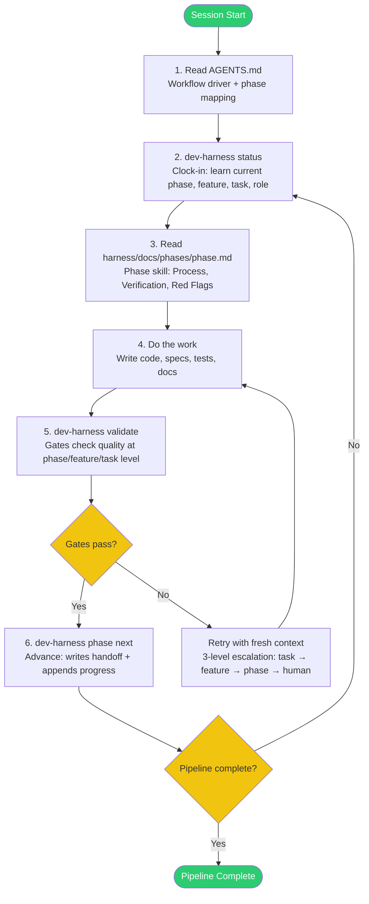
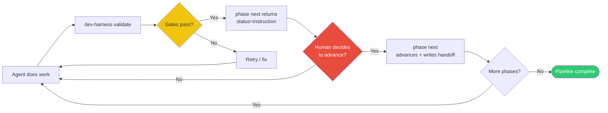
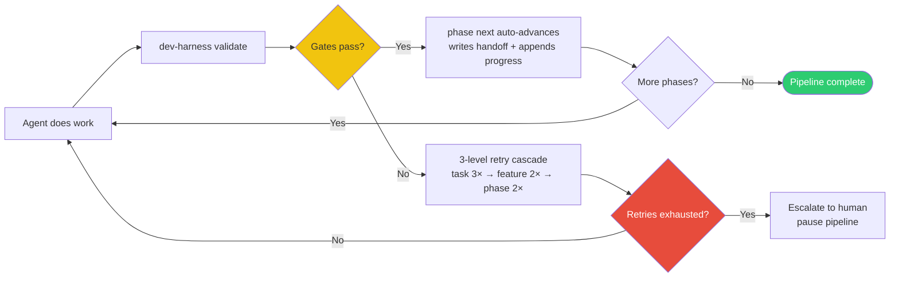

<div align="center">

# 🎯 Dev Harness

### *Agent-Agnostic Development Pipeline — Backend for AI Coding Agents*

**Scaffold · Phase Orchestration · Gate Validation · Iterative Refinement**

[](https://www.npmjs.com/package/dev-harness-cli)
[](https://opensource.org/licenses/MIT)
[](https://nodejs.org)
[](#-dependencies)
[](#)
[](#)

🧰 **Works with any coding agent — the agent is the frontend, dev-harness is the backend**

> 💡 **Works best with coding agents that support session-end upon completion** — this enables fresh-context enforcement at every boundary.

</div>

---

## 📋 Table of Contents

- [🤔 What Is This?](#-what-is-this)
- [🏗️ Architecture](#-architecture)
  - [Agent-as-Frontend](#agent-as-frontend)
  - [Pipeline Phases](#pipeline-phases)
  - [3-Level Loops (Ralph Pattern)](#3-level-loops-ralph-pattern)
  - [3-Level Retry](#3-level-retry)
  - [Copilot vs Autopilot Modes](#copilot-vs-autopilot-modes)
  - [Multi-Agent Role Framework](#multi-agent-role-framework)
  - [Session-Boundary Enforcement](#session-boundary-enforcement)
- [🚀 Quick Start](#-quick-start)
- [🧠 How It Works](#-how-it-works)
  - [Gate Validation (3 Levels)](#gate-validation-3-levels)
  - [Pass Criteria (3 Levels)](#pass-criteria-3-levels)
  - [Phase Skill Files](#phase-skill-files)
- [📁 Project Structure](#-project-structure)
- [⚙️ CLI Reference](#-cli-reference)
- [🔧 Configuration](#-configuration)
- [📤 JSON Output](#-json-output)
- [📦 Dependencies](#-dependencies)
- [🙏 Acknowledgements & Influences](#-acknowledgements--influences)
- [📄 License](#-license)

---

## 🤔 What Is This?

**Dev Harness** is a CLI backend that brings **deterministic structure** to AI-assisted software development. Instead of ad-hoc prompting — where agents hallucinate scope, skip steps, or rubber-stamp their own work — Dev Harness enforces a **phase pipeline** with **gate validation** at three levels: phase, feature, and task.

> 🎯 **Specs before code. Review before shipping. Nothing skipped.**

**Your coding agent is the frontend.** You start your agent in your project. The agent reads `AGENTS.md` (the workflow driver) + phase skill files, then calls dev-harness CLI commands (`status`, `validate`, `phase next`) to progress through the pipeline. Dev Harness enforces gates, phase order, and state — the agent does the work.

```mermaid
flowchart LR
    INIT[🏗️ INIT<br/>Scaffold] --> DEFINE[📐 DEFINE<br/>Specs + contract]
    DEFINE --> PLAN[📋 PLAN<br/>Features + tasks]
    PLAN --> BUILD[🛠️ BUILD<br/>Implement features + tasks]
    BUILD --> VERIFY[✅ VERIFY<br/>Tests + coverage]
    VERIFY -.-> SIMPLIFY[🧹 SIMPLIFY<br/>Refactor]
    VERIFY --> REVIEW[🔍 REVIEW<br/>Multi-agent committee]
    SIMPLIFY --> REVIEW
    REVIEW --> SHIP[🚀 SHIP<br/>Tag + release]

    style INIT fill:#95A5A6,color:#fff,stroke:none
    style DEFINE fill:#4A90D9,color:#fff,stroke:none
    style PLAN fill:#50C878,color:#fff,stroke:none
    style BUILD fill:#FF8C42,color:#fff,stroke:none
    style VERIFY fill:#9B59B6,color:#fff,stroke:none
    style SIMPLIFY fill:#F1C40F,color:#333,stroke:none
    style REVIEW fill:#E74C3C,color:#fff,stroke:none
    style SHIP fill:#2ECC71,color:#fff,stroke:none
```



Each phase, feature, and task has **deterministic gates** — automated checks that must pass before the pipeline can advance. The agent does the work; the harness validates the result. No more wondering if the agent actually finished what it said it did.

### ✨ Key Features

| | Feature | Description | Inspired by |
|---|---------|-------------|-------------|
| 🧩 | **Agent-Agnostic** | Generates `AGENTS.md` natively, plus tool-specific replicas (`CLAUDE.md`, `.cursorrules`) for agents that don't read `AGENTS.md` | — |
| 🚦 | **Phase Pipeline** | 7-phase workflow: Define → Plan → Build → Verify → Simplify → Review → Ship | [Addy Osmani](https://github.com/addyosmani/agent-skills) (6-phase pipeline + skill anatomy) |
| 🚧 | **Gate Validation** | Deterministic pass/fail checks at phase, feature, and task levels — no skipping steps | [Anthropic](https://anthropic.com/engineering/effective-harnesses) (generator/evaluator split) + [Addy Osmani](https://github.com/addyosmani/agent-skills) |
| 🔄 | **Ralph Loops** | 3 nested loops: phase (outer) → feature (middle) → task (inner), with fresh-context retry | [Dean Huntley](https://ghuntley.com/ralph) (Ralph pattern) |
| 🔁 | **3-Level Retry** | Configurable retry at task, feature, and phase levels with escalation chain | [Dean Huntley](https://ghuntley.com/ralph) |
| 🧑‍⚖️ | **Multi-Agent Roles** | Planner/Generator/Evaluator/Simplifier committee with personas + self-evaluation guard | [Anthropic](https://anthropic.com/engineering/effective-harnesses) (generator/evaluator split) |
| 📝 | **Sprint Contracts** | Pre-build negotiation between agent roles for spec/code agreement | [Anthropic](https://anthropic.com/engineering/effective-harnesses) (sprint contracts) |
| 📋 | **Criteria Enforcement** | Task (`acceptanceCriteria`), feature (`definitionOfDone`), and phase (`Verification Criteria`) pass criteria — no placeholder shipping | [Anthropic](https://anthropic.com/engineering/effective-harnesses) + [Addy Osmani](https://github.com/addyosmani/agent-skills) |
| 🤝 | **Session Handoff** | 3-file split: handoff snapshot, append-only history, lessons+decisions | [Dean Huntley](https://ghuntley.com/ralph) (progress.md) + walkinglabs L05/L12 (clock-in/out, clean-state) |
| 🏗️ | **31+ Stack Templates** | Python, Node.js, Go, Rust, C, C++, Java, Kotlin, .NET, Ruby, PHP, Swift, Elixir, and many more | — |
| 🏭 | **Custom Stacks** | Unlimited custom language/platform support via `config.stackMeta` | — |
| 🧹 | **Cleanup & Audit** | Stale artifact scanning, empty dir detection, active-gate auditing | walkinglabs L12 (entropy management) |
| 📦 | **Minimal Dependencies** | 4 runtime deps — each chosen for a concrete robustness win | — |

---

## 🏗️ Architecture

### Agent-as-Frontend

Dev Harness is a **backend CLI**. Your coding agent is the **frontend** — it reads instruction files and calls CLI commands to follow the workflow.



### How the agent follows the workflow (detailed)

The workflow is a **sequential loop** — not parallel. At each phase, the agent:

1. **Clock-in:** `dev-harness status` — learns current phase, feature, task, role, gate status, retry counters, next action (reads `session-handoff.md`)
2. **Read phase skill:** `harness/docs/phases/<phase>.md` — Process steps, Verification criteria, Rationalizations to avoid, Red flags
3. **Role setup:** `dev-harness role <name>` — sets current role (planner/generator/evaluator/simplifier), fires session boundary (writes handoff + clean-state check), injects persona tone
4. **Do the work:**
   - **DEFINE:** Planner writes specs (`specs/prd.md`), proposes sprint contract (`contract propose --scope "..." --criteria "..."`), negotiates with evaluator (`contract review --agreed/--needs-revision`)
   - **PLAN:** Planner breaks specs into features (each with tasks + `acceptanceCriteria` + `definitionOfDone`), writes `feature-list.json`
   - **BUILD:** Generator implements features one at a time — for each feature, for each task: implement → `validate --feature X --task Y` (checks task-criteria gate) → pass=next task / fail=retry
   - **VERIFY:** Evaluator validates all features pass, tests + coverage
   - **SIMPLIFY:** Simplifier refactors, removes dead code, empty dirs
   - **REVIEW:** Evaluator fills rubric, committee review
   - **SHIP:** Tag, changelog, release
5. **Validate:** `dev-harness validate` — gates check quality at phase level; `validate --feature X --task Y` checks at task level (task-criteria + lint + tests + coverage)
6. **Advance:** `dev-harness phase next` — checks current-phase gates, enforces order, writes handoff (session-boundary trigger #3), appends progress
7. **Repeat** until pipeline complete

**Session boundaries** fire at 7 triggers: task complete (#1), feature complete (#2), phase transition (#3), pause (#4), context budget low (#5), human session end (#6), role handoff (#7). Each boundary writes `session-handoff.md` + runs clean-state gate + appends `progress.md`.

### Enforcement

| Layer | Mechanism | Type |
|-------|-----------|------|
| **Gates (3 levels)** | `validate` checks quality at phase, feature, and task levels before advancing | Hard |
| **Phase order** | `phase next` enforces define→plan→build→verify→review→ship — can't skip | Hard |
| **State machine** | `config.json` tracks current phase, feature, task, role, retry counters (task/feature/phase), gate history — can't fake advancement | Hard |
| **Role gates** | `validate` in BUILD/VERIFY requires `currentRole=evaluator`; DEFINE task-level requires `planner`; `contract propose` requires `planner`; `contract review` requires `evaluator` | Hard |
| **Self-eval guard** | Generator cannot evaluate its own work — `producedByRole` recorded on task completion; if same role tries to validate, blocked | Hard |
| **Pass criteria (3 levels)** | Task (`acceptanceCriteria`), feature (`definitionOfDone`), phase (`Verification Criteria`) — all must be non-empty + non-placeholder | Hard |
| **AGENTS.md + replicas** | `AGENTS.md` is canonical; `CLAUDE.md` and `.cursorrules` are replicas generated at init for agents that don't read `AGENTS.md` | Soft |

### Pipeline Phases

| Phase | 🎯 Goal | 📦 Key Artifact | 🚧 Gate(s) |
|-------|---------|-----------------|------------|
| 🔵 **DEFINE** | Write specs before any code | `specs/prd.md` + `sprint-contract.md` | `feature-branch`, `contract-agreed`, `contract-criteria` |
| 🟢 **PLAN** | Break specs into features, each consisting of actionable tasks | `feature-list.json` (features + tasks + acceptanceCriteria + definitionOfDone) | `git-clean` |
| 🟠 **BUILD** | Implement features and tasks one at a time | Working code | `git-clean`, `lint`, `tests`, `contract-agreed`, `contract-criteria`, `coverage`, `anti-placeholder` |
| 🟣 **VERIFY** | Validate and test everything | Passing test suite | `git-clean`, `tests`, `coverage` |
| 🟡 **SIMPLIFY** | Refactor, reduce complexity | Cleaner codebase | `git-clean`, `no-empty-dirs` |
| 🔴 **REVIEW** | Multi-agent committee review | Review report | `branch-up-to-date`, `rubric-content`, `readme`, `architecture`, `decisions` |
| 🟢 **SHIP** | Tag, changelog, publish | Release | `git-clean`, `tagged`, `changelog`, `readme`, `license`, `contributing`, `no-empty-dirs`, `anti-placeholder` |

> 🧹 **SIMPLIFY** is optional — it runs after VERIFY only if `simplify` is in your phase list.

### 3-Level Loops (Ralph Pattern)

The architecture is built on the **Ralph pattern** — 3 nested loops that give the agent fresh context on each retry. Each loop is a distinct module with a single responsibility:

```
┌──────────────────────────────────────────────────────────┐
│                    🌐 PHASE LOOP (outer)                  │
│  cli/lib/ralph-phases.mjs — runPhase / continuePipeline   │
│  define → plan → build → verify → [simplify] → review → ship │
│  (phase transitions, gate validation, human escalation)  │
│  Dispatches to feature loop (feature-iterate phases) or  │
│  deliverable handler (deliverable-retry phases)           │
└──────────────────────┬───────────────────────────────────┘
                       │ for each phase
                       ▼
┌──────────────────────────────────────────────────────────┐
│                    🔄 FEATURE LOOP (middle)              │
│  cli/lib/ralph-features.mjs — runFeatureLoop              │
│  For each feature in feature-list.json:                  │
│    check definitionOfDone → implement → validate         │
│  (feature-level criteria gate before marking passes=true) │
└──────────────────────┬───────────────────────────────────┘
                       │ for each feature
                       ▼
┌──────────────────────────────────────────────────────────┐
│                    🔁 TASK LOOP (inner)                  │
│  cli/lib/ralph-tasks.mjs — runTaskLoop                    │
│  For each task in feature:                               │
│    check acceptanceCriteria → implement → validate       │
│    pass=next task / fail=retry (fresh git context)       │
│  (task-level criteria gate before marking complete)       │
└──────────────────────────────────────────────────────────┘

Shared utilities (feature-list I/O, phase classification, output builders)
live in cli/lib/ralph-shared.mjs — the leaf of the dependency graph:
  ralph-shared ← ralph-tasks ← ralph-features ← ralph-phases
```

When building or verifying, the harness enters the **task loop** (innermost) that iterates over tasks within a feature. When all tasks in a feature pass, the **feature loop** (middle) advances to the next feature. When all features pass, the **phase loop** (outer) advances to the next phase.

The critical insight: **on retry, the harness resets to a clean git state** (`git reset --hard` + clean). This forces the agent to re-approach the problem with fresh context — avoiding the common failure mode of compounding its own mistakes.

### 3-Level Retry

Retry is configurable at three independent levels with the escalation chain **task → feature → phase → human**:

| Level | Config | Trigger | Action |
|-------|--------|---------|--------|
| **Task** | `retry.tasks.enabled` | Per-task gate or criteria failure | Retry same task up to `maxRetries` |
| **Feature** | `retry.features.enabled` | Task exhaustion | Reset feature's tasks, re-sweep |
| **Phase** | `retry.phases.enabled` | Feature exhaustion | Reset all features, re-run phase |

```bash
# Enable all retry levels
dev-harness config set retry.features.enabled true
dev-harness config set retry.phases.enabled true
```

### Copilot vs Autopilot Modes

#### Copilot Mode (default)

Human-in-loop. The agent does the work; the human decides when to advance.



- Task retry only (maxRetries=10, human in loop)
- Feature/phase retry off by default
- `phase next` returns `status=instruction` — agent/human decides to advance
- Best for: interactive agents, human-supervised workflows

#### Autopilot Mode

Autonomous. The harness auto-advances through phases when gates pass.



- Full 3-level cascade ON by default: task 3× → feature 2× → phase 2× = 12 attempts before human
- `phase next` auto-advances when gates pass
- Best for: autonomous agents, CI/CD pipelines, agents that support session-end-on-completion

```bash
# Scaffold in autopilot mode
dev-harness init --stack node --mode autopilot

# Switch modes mid-pipeline (autopilot requires DEFINE phase or later)
dev-harness set-mode autopilot
dev-harness set-mode copilot
```

### Multi-Agent Role Framework

The harness implements a planner/generator/evaluator/simplifier committee via **separate agent sessions per role**. Each role is a different agent session with a **different persona** — the harness enforces role separation, clean handoffs, and prevents self-evaluation.

| Role | Persona | Responsibility | Active in | Gate Enforcement |
|------|---------|---------------|------------|------------------|
| **Planner** | Analytical and precise. Define clear boundaries. | Define scope, write specs, propose contracts | DEFINE | `contract propose` requires planner; DEFINE task-level `validate` requires planner |
| **Generator** | Focused and practical. Build what's specified, nothing more. | Implement features, write code | BUILD | Produces work (`producedByRole=generator` recorded on task completion) |
| **Evaluator** | Skeptical and thorough. Accept only compelling evidence. | Review, validate, sign off | BUILD, VERIFY, REVIEW | `validate` in BUILD/VERIFY requires evaluator; `contract review` requires evaluator |
| **Simplifier** | Relentless about clarity. Delete more than you add. | Refactor, reduce complexity | SIMPLIFY | — |

**Roles are set manually per session** — the harness enforces *which* role can do *what*, but doesn't auto-rotate (backend-only by design). The rotation flow per task:

1. `dev-harness role planner` → planner scopes the task (DEFINE)
2. `dev-harness role generator` → generator implements the task (BUILD)
3. `dev-harness role evaluator` → evaluator validates the task (BUILD/VERIFY validate requires evaluator)

**Self-evaluation guard:** The generator cannot evaluate its own work. When a task is marked complete, `producedByRole` is recorded. If the same role tries to validate (`currentRole === producedByRole`), validation is blocked — a different session must evaluate.

```bash
# Switch roles (fires session boundary — writes handoff + clean-state check + injects persona)
dev-harness role planner
dev-harness role generator
dev-harness role evaluator
dev-harness role simplifier
```

### Session-Boundary Enforcement

At every session boundary (role handoff, phase transition, task/feature complete, pause), the harness:

1. **Writes `session-handoff.md`** (overwrite) — clock-out snapshot with current phase, feature, task, role, gate status, next action, retry counters
2. **Runs the clean-state gate** (advisory) — 5 conditions: lint, tests, handoff exists, no stale artifacts, startup path works
3. **Appends to `progress.md`** (append-only) — history log

```bash
# Fatal clean-state check on demand
dev-harness validate --session-exit

# Enable clean-state gate at boundaries
dev-harness config set gates.cleanState.enabled true
dev-harness config set gates.cleanState.stalePatterns --json-value '["console.log","TODO"]'
```

> 💡 **Works best with agents that support session-end upon completion.** Agents that can programmatically exit + restart get full fresh-context enforcement via an external shell loop. Interactive agents get partial enforcement (role gates + clean handoffs still enforce separation).

---

## 🚀 Quick Start

```bash
# 🏁 One-liner — no install needed
npx dev-harness-cli init --stack python --target my-project

# 📦 Global install
npm install -g dev-harness-cli
dev-harness --help
```

> **Requires Node.js >= 18.** Minimal, audited runtime dependencies.

### Your First Pipeline

```bash
# 1️⃣ Scaffold the harness in your project
cd my-project
dev-harness init --stack node

# 2️⃣ Start your coding agent
#    - If your agent reads AGENTS.md natively (Codex, OpenCode, etc.): just start it
#    - If your agent needs a specific file (Claude Code, Cursor): use --agent-tool
dev-harness init --stack node --agent-tool claude-code  # generates CLAUDE.md (replica of AGENTS.md)
dev-harness init --stack node --agent-tool cursor       # generates .cursorrules (replica of AGENTS.md)

# 3️⃣ Inside the agent, follow the workflow:
#    - Agent reads AGENTS.md (or CLAUDE.md / .cursorrules) → sees workflow + phase mapping
#    - Agent calls: dev-harness status → clock-in (learns current phase, feature, task, role)
#    - Agent calls: dev-harness role planner → sets role, injects persona, writes handoff
#    - Agent reads: harness/docs/phases/define.md → DEFINE skill instructions
#    - Agent does the work (writes specs, proposes contract with --criteria)
#    - Agent calls: dev-harness validate → gates check at phase/feature/task level
#    - Agent calls: dev-harness phase next → advance (writes handoff + appends progress)
#    - Repeat through: DEFINE → PLAN → BUILD → VERIFY → REVIEW → SHIP
```

### Agent Tool Integration

The harness generates instruction files your agent reads. Use `--agent-tool` to specify:

```bash
# AGENTS.md only (works with any agent that reads it)
dev-harness init --stack node

# Generate tool-specific instruction file (replica of AGENTS.md)
dev-harness init --stack node --agent-tool claude-code  # → CLAUDE.md
dev-harness init --stack node --agent-tool cursor       # → .cursorrules

# Generate SKILL.md manifest format (for agents that use the skill format)
dev-harness init --stack node --agent-tool skill

# Multiple tools (comma-separated)
dev-harness init --stack node --agent-tool claude-code,cursor

# All supported tools
dev-harness init --stack node --agent-tool all
```

> **All instruction files are generated from `AGENTS.md` content** — single source of truth. `CLAUDE.md` and `.cursorrules` are replicas with a tool-specific header.

---

## 🧠 How It Works

### Gate Validation (3 Levels)

Gates run at three levels — phase, feature, and task — with deterministic pass/fail checks:

| Level | When it runs | What it checks | Example gates |
|-------|-------------|----------------|---------------|
| **Phase** | `validate` (full phase) | Phase-level quality | `git-clean`, `lint`, `tests`, `coverage`, `contract-agreed`, `contract-criteria`, `anti-placeholder`, `rubric-content`, `tagged`, `readme`, `license` |
| **Feature** | When all tasks in a feature complete | Feature-level criteria | `feature-criteria` (checks `definitionOfDone` is non-empty + non-placeholder) |
| **Task** | `validate --feature X --task Y` | Task-level quality + criteria | `task-criteria` (checks `acceptanceCriteria`), `lint`, `tests`, `coverage` |

Gates prevent the most common failure modes in AI-assisted development:

- 🚫 **No skipping** — can't ship without reviewing
- 📝 **No coding without specs** — DEFINE gates must pass before BUILD
- 🔍 **No self-review leniency** — REVIEW uses multi-agent committee + self-eval guard
- 🧹 **No dead code or empty dirs** — SIMPLIFY gates keep the codebase clean
- 🚫 **No placeholders** — `anti-placeholder` gate catches TODO/FIXME/console.log/debugger
- 📋 **No empty criteria** — `contract-criteria` + `task-criteria` + `feature-criteria` gates enforce real pass criteria at all 3 levels

Gates are **ON by default**. Use `--no-gates` at init to disable:

```bash
dev-harness init --stack node --no-gates
```

### Pass Criteria (3 Levels)

Criteria enforcement mirrors the 3-level retry — criteria must be met at each level before advancing:

| Level | Field | Where | Gate | What it checks |
|-------|-------|-------|------|-----------------|
| **Task** | `acceptanceCriteria` | `feature-list.json` → task | `task-criteria` | List is non-empty + non-placeholder before allowing `status: complete` |
| **Feature** | `definitionOfDone` | `feature-list.json` → feature | `feature-criteria` | List is non-empty + non-placeholder before allowing `passes: true` |
| **Phase** | `## Verification Criteria` | `sprint-contract.md` | `contract-criteria` | Section has ≥1 non-placeholder line before phase gate passes |

All criteria fields are **lists** (a criterion is rarely single). Gate passes only when *all* items are non-placeholder.

### Phase Skill Files

Each phase has a skill file (`harness/docs/phases/<phase>.md`) following the [addyosmani/agent-skills](https://github.com/addyosmani/agent-skills) anatomy:

- **Overview** — what this phase does
- **When to Use** — triggering conditions
- **Process** — step-by-step workflow with CLI commands
- **Rationalizations to Avoid** — excuses + rebuttals
- **Red Flags** — signs something's wrong
- **Verification** — evidence requirements
- **Handoff** — `dev-harness phase next` + role transition

---

## 📁 Project Structure

After `dev-harness init`, your project looks like:

```
my-project/
├── AGENTS.md                    # Workflow driver (canonical — agent reads this)
├── CLAUDE.md                    # Claude Code instructions (if --agent-tool claude-code; replica of AGENTS.md)
├── .cursorrules                 # Cursor instructions (if --agent-tool cursor; replica of AGENTS.md)
├── harness/
│   ├── config.json              # State machine + configuration (tracks phase, feature, task, role, retries)
│   ├── features/
│   │   └── feature-list.json    # Features + tasks (with acceptanceCriteria + definitionOfDone)
│   ├── session-handoff.md       # Clock-out snapshot (overwritten per boundary)
│   ├── progress.md              # Append-only history log
│   ├── lessons-decisions.md     # Append-only lessons + decisions (paired)
│   ├── sprint-contract.md       # Pre-build agreement (with ## Verification Criteria)
│   ├── evaluator-rubric.md      # Quality scorecard (6 dimensions)
│   ├── scripts/
│   │   ├── init.sh              # Install → verify → start
│   │   ├── run-hermes-session.sh    # Session-enforcement loop (Hermes)
│   │   └── run-openclaw-session.sh  # Session-enforcement loop (OpenClaw)
│   └── docs/
│       ├── phases/              # Phase skill files (addyosmani anatomy)
│       │   ├── define.md
│       │   ├── plan.md
│       │   ├── build.md
│       │   ├── verify.md
│       │   ├── simplify.md
│       │   ├── review.md
│       │   └── ship.md
│       └── agents/              # Agent role guides (with persona tones)
│           ├── planner.md
│           ├── generator.md
│           ├── evaluator.md
│           └── simplifier.md
├── src/                         # Your source code
├── tests/                       # Your tests
└── package.json                 # (or pyproject.toml, Cargo.toml, etc.)
```

---

## ⚙️ CLI Reference

| Command | Description |
|---------|-------------|
| `dev-harness init` | Scaffold full harness in current directory (`--no-gates`, `--mode autopilot`, `--agent-tool`) |
| `dev-harness status` | Show current phase, feature, task, role, gate state, session state (clock-in) |
| `dev-harness phase <name>` | Invoke a phase (define/plan/build/verify/simplify/review/ship) |
| `dev-harness phase next` | Advance to next phase (checks gates, enforces order, writes handoff) |
| `dev-harness validate` | Run gate checks for current phase (`--session-exit` for clean-state) |
| `dev-harness validate --feature X --task Y` | Validate a single task (checks task-criteria gate + lint/tests/coverage) |
| `dev-harness role <planner/generator/evaluator/simplifier>` | Set current role, fire handoff, inject persona |
| `dev-harness decision "text"` | Record a decision in lessons-decisions.md |
| `dev-harness config list` | List all config parameters |
| `dev-harness config get [key]` | Get config value |
| `dev-harness config set <key> <val>` | Set config value (`--json-value` for arrays/objects) |
| `dev-harness learn "message"` | Append a lesson to progress.md |
| `dev-harness contract propose` | Write/update sprint-contract.md (requires `--criteria`, planner role) |
| `dev-harness contract review` | Evaluator reviews contract (requires evaluator role) |
| `dev-harness contract status` | Show current contract state |
| `dev-harness contract escalate` | Human adjudication |
| `dev-harness worktree create/list/prune/remove` | Git worktree management |
| `dev-harness rollback list/to/branch` | Checkpoint recovery |
| `dev-harness checkpoint create <label>` | Manual checkpoint tag |
| `dev-harness pause` | Pause pipeline (fires session boundary) |
| `dev-harness resume` | Resume pipeline (resets retry counters) |
| `dev-harness set-mode <copilot/autopilot>` | Switch execution mode |
| `dev-harness cleanup` | Scan for stale artifacts, empty dirs (`--auto-fix`) |
| `dev-harness audit` | Report active gates, retry levels, suggestions |
| `dev-harness --help` | Show full help |
| `dev-harness --version` | Show version |

---

## 🔧 Configuration

All configuration lives in `harness/config.json`. View with:

```bash
dev-harness config list
```

<details>
<summary>📋 Click to see configuration groups</summary>

| Group | Parameters | Description |
|-------|-----------|-------------|
| ⚡ **Execution** | `mode`, `paused`, `maxRetries` | Runtime behavior (copilot/autopilot) |
| 🎭 **Role** | `currentRole`, `currentFeature`, `currentTask` | Current agent role + active feature/task (tracked by state machine) |
| 🔁 **Retry** | `retry.tasks.*`, `retry.features.*`, `retry.phases.*` | 3-level retry configuration |
| 🏗️ **Stack** | `stack`, `stackMeta` | Language/platform configuration |
| 🧰 **Agent Tool** | `agentTool` | Agent tool selection (claude-code, cursor, codex, skill, etc.) |
| 🚧 **Gates** | `gates.enabled`, `gates.coverage.*`, `gates.cleanState.*`, `gates.antiPlaceholder.*` | Gate validation settings |
| 🧹 **Cleanup** | `cleanup.schedule`, `cleanup.autoFix` | Stale artifact cleanup configuration |
| 🌿 **Git** | `git.autoCommit`, `git.autoTag`, `git.resetOnRetry` | Git integration behavior |
| 🚦 **Phases** | `phases.enabled` | Pipeline phase configuration |
| 🎭 **Personas** | `agents.tone.*` | Persona instructions per role (injected into `role` command output) |
| 💾 **Runtime State** | `currentPhase`, `retryCount`, `taskRetryCount`, `featureRetryCount`, `phaseRetryCount`, `pipelineIteration`, `gateHistory`, `features.*` | Live pipeline state (read-only) |

</details>

See [docs/CONFIGURATION.md](docs/CONFIGURATION.md) for the full reference.

---

## 📤 JSON Output

All commands support `--json` for machine-parseable output — perfect for CI/CD pipelines, wrapper scripts, and agent integration.

```bash
dev-harness status --json
dev-harness phase next --json
dev-harness validate --json
```

```json
{
  "command": "status",
  "status": "ok",
  "currentPhase": "define",
  "currentFeature": "feature-001",
  "currentTask": "task-001",
  "stack": "node",
  "mode": "copilot",
  "currentRole": "planner",
  "sessionState": {
    "Current Phase": "define",
    "Current Feature": "feature-001",
    "Current Role": "planner",
    "Gate Status": "pass",
    "Next Action": "Run: dev-harness validate (define gate) → phase next"
  }
}
```

| Convention | Rule |
|------------|------|
| ✅ **stdout** | Always valid JSON — machine-parseable, no exceptions |
| ❌ **stderr** | All errors (JSON errors included) — stdout stays parseable on failure |
| **Exit codes** | `0` success, `1` validation failure, `2` usage error, `3` internal error |
| **JSON contract** | Every response includes `command`, `status`, `message` |

---

## 📦 Dependencies

Dev Harness uses a **minimal, audited** dependency set. Each dependency was chosen for a concrete robustness win.

| Dependency | Version | Why |
|------------|---------|-----|
| [`ajv`](https://github.com/ajv-validator/ajv) | ^8 | Full JSON Schema draft-07 support — validates config + feature list |
| [`simple-git`](https://github.com/steveukx/git-js) | ^3 | Async git ops — typed results, eliminates command injection risk |
| [`picocolors`](https://github.com/alexeyraspopov/picocolors) | ^1 | TTY detection, `NO_COLOR`/`FORCE_COLOR` conformance, Windows support |
| [`string-width`](https://github.com/sindresorhus/string-width) | ^7 | Correctly measures emoji, combining marks, CJK wide chars |

> **Supply-chain posture:** 4 direct deps, all from established maintainers. `npm audit` reports 0 vulnerabilities.

---

## 🙏 Acknowledgements & Influences

Dev Harness was built on the shoulders of foundational work in the **harness engineering** space:

| Influence | Links | Impact |
|-----------|-------|--------|
| **Ralph Pattern**<br>by Dean Huntley | [`ghuntley.com/ralph`](https://ghuntley.com/ralph) · [`snarktank/ralph`](https://github.com/snarktank/ralph) | 🧠 Core architecture — 3-level loops (phase/feature/task), fresh-context retry, progress.md, session handoff |
| **Agent Skills**<br>by Addy Osmani | [`github.com/addyosmani/agent-skills`](https://github.com/addyosmani/agent-skills) | 🚦 Pipeline & skill anatomy — 7-phase pipeline, committee review, skill file format, gate validation |
| **Anthropic**<br>Harness Research | ["Effective Harnesses"](https://anthropic.com/engineering/effective-harnesses) | 📝 Generator/Evaluator split, sprint contracts, rollback, multi-agent roles, pass criteria |
| **OpenAI**<br>Harness Engineering | ["Harness Engineering"](https://openai.com/index/harness-engineering/) | 🌿 Worktree isolation, progressive disclosure |
| **walkinglabs**<br>L05/L12 | Session lifecycle research | 🤝 Clock-in/clock-out routine, clean-state gate (5 conditions), entropy management, 3-file handoff split |

---

## 📄 License

[MIT](LICENSE) © 2026 Bakr Bagaber

---

<div align="center">
  <sub>Built with ☕ and 🤖 · Questions? Open an issue · Contributions welcome!</sub>
  <br>
  <sub>
    <a href="#-dev-harness">↑ Back to top</a>
  </sub>
</div>
