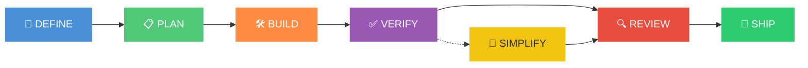
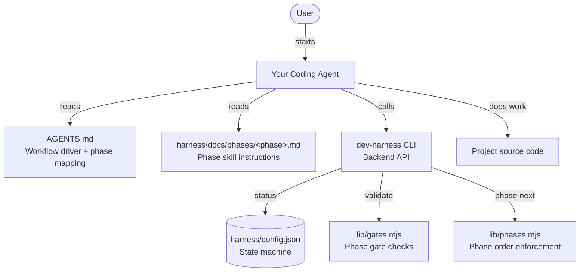
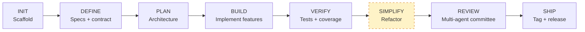
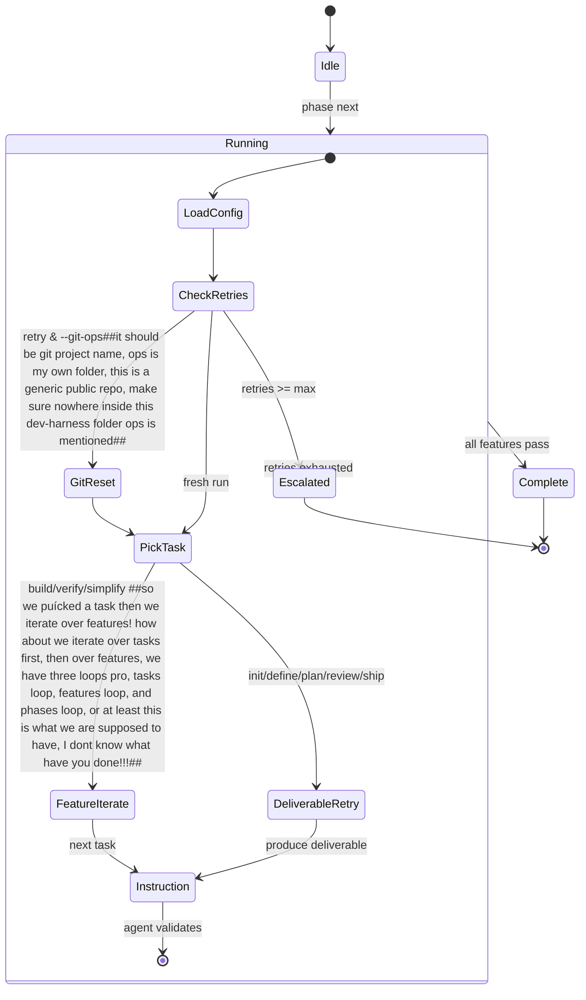

<div align="center">

# 🎯 Dev Harness

### *Agent-Agnostic Development Pipeline — Backend for AI Coding Agents*

**Scaffold · Phase Orchestration · Gate Validation · Iterative Refinement**

[](https://www.npmjs.com/package/dev-harness-cli)
[](https://opensource.org/licenses/MIT)
[](https://nodejs.org)
[](#-dependencies)
[](#)
[](#)

🧰 **Works with any coding agent — the agent is the frontend, dev-harness is the backend**

> 💡 **Works best with coding agents that support session-end upon completion** — this enables fresh-context enforcement at every boundary.

</div>

---

## 📋 Table of Contents

- [🤔 What Is This?](#-what-is-this)
- [🏗️ Architecture](#-architecture)
  - [Agent-as-Frontend](#agent-as-frontend)
  - [7-Phase Pipeline](#7-phase-pipeline)
  - [Ralph Inner/Outer Loop](#ralph-innerouter-loop)
  - [3-Level Retry](#3-level-retry)
  - [Multi-Agent Role Framework](#multi-agent-role-framework)
  - [Session-Boundary Enforcement](#session-boundary-enforcement)
- [🚀 Quick Start](#-quick-start)
- [🧠 How It Works](#-how-it-works)
  - [Pipeline Phases](#pipeline-phases)
  - [Phase Skill Files](#phase-skill-files)
  - [Gate Validation](#gate-validation)
  - [Ralph Inner / Outer Loops](#ralph-inner--outer-loops)
- [📁 Project Structure](#-project-structure)
- [⚙️ CLI Reference](#-cli-reference)
- [🔧 Configuration](#-configuration)
- [📤 JSON Output](#-json-output)
- [📦 Dependencies](#-dependencies)
- [🙏 Acknowledgements & Influences](#-acknowledgements--influences)
- [📄 License](#-license)

---

## 🤔 What Is This?

**Dev Harness** is a CLI backend that brings **deterministic structure** to AI-assisted software development. Instead of ad-hoc prompting — where agents hallucinate scope, skip steps, or rubber-stamp their own work — Dev Harness enforces a **phase pipeline** with **gate validation**.

> 🎯 **Specs before code. Review before shipping. Nothing skipped.**

**Your coding agent is the frontend.** You start your agent in your project. The agent reads `AGENTS.md` (the workflow driver) + phase skill files, then calls dev-harness CLI commands (`status`, `validate`, `phase next`) to progress through the pipeline. Dev Harness enforces gates, phase order, and state — the agent does the work.



Each phase ##the gates are not only phases, but also at tasks and features, update that## has **deterministic gates** — automated checks that must pass before the pipeline can advance. The agent does the work; the harness validates the result. No more wondering if the agent actually finished what it said it did.

### ✨ Key Features

| | Feature | Description |
|---|---------|-------------|
| 🧩 | **Agent-Agnostic** | Works with any coding agent that reads instruction files (`AGENTS.md`) ##it also supports claude and cursor which have dont read agents.md, update that## |
| 🚦 | **Phase Pipeline** | 7-phase workflow: Define → Plan → Build → Verify → Simplify → Review → Ship | ##mention that this part was insipred by whome##
| 🚧 | **Gate Validation** | Every phase has deterministic pass/fail checks — no skipping steps | ##mention that this part was insipred by whome##
| 🔄 | **Ralph Loops** | Inner/outer iterative loops with fresh-context retry (inspired by [ghuntley.com/ralph](https://ghuntley.com/ralph)) |
| 🔁 | **3-Level Retry** | Configurable retry at task, feature, and phase levels |
| 🧑‍⚖️ | **Multi-Agent Roles** | Planner/Generator/Evaluator/Simplifier committee with self-evaluation guard | ##mention that this part was insipred by whome##
| 📝 | **Sprint Contracts** | Pre-build negotiation between agent roles for spec/code agreement | ##mention that this part was insipred by whome##
| 📋 | **Criteria Enforcement** | Task, feature, and phase-level pass criteria — no placeholder shipping |
| 🤝 | **Session Handoff** | 3-file split: handoff snapshot, append-only history, lessons+decisions | ##mention that this part was insipred by whome##
| 🏗️ | **31+ Stack Templates** | Python, Node.js, Go, Rust, C, C++, Java, Kotlin, .NET, Ruby, PHP, Swift, Elixir, and many more |
| 🏭 | **Custom Stacks** | Unlimited custom language/platform support via `config.stackMeta` |
| 🧹 | **Cleanup & Audit** | Stale artifact scanning, empty dir detection, active-gate auditing |
| 📦 | **Minimal Dependencies** | 4 runtime deps — each chosen for a concrete robustness win |

---

## 🏗️ Architecture

### Agent-as-Frontend

Dev Harness is a **backend CLI**. Your coding agent is the **frontend** — it reads instruction files and calls CLI commands to follow the workflow.

##This blick diagram does not show sequency, it shows everything in parallel, before you draw something, think twice and make sure it actually explains the workfloe, fix it##


### How the agent follows the workflow
##this is very high level, you should elaborate more, where is the handoffs, criteria checks, tasks, features, and phases, retry loops on all levels, 3 levels, where is the coontract, each phase of the seven phases is not elaborated, .... and and and##
1. Agent reads `AGENTS.md` — workflow driver with phase mapping + rules
2. Agent calls `dev-harness status` — learns current phase (clock-in)
3. Agent reads `harness/docs/phases/<phase>.md` — phase skill with Process/Verification/Red Flags
4. Agent does the work (writes code, specs, tests)
5. Agent calls `dev-harness validate` — gates check quality
6. Agent calls `dev-harness phase next` — advance (enforces order + gates, writes handoff)
7. Repeat until pipeline complete

### Enforcement

| Layer | Mechanism | Type |
|-------|-----------|------|
| **Gates** | `validate` checks quality before advancing | Hard |
| **Phase order** | `phase next` enforces define→plan→build→verify→review→ship | Hard |
| **State machine** | `config.json` tracks current phase — can't fake advancement | Hard | ##does it only tracks phases or also features and tasks, you better andwear this!!!!##
| **Role gates** | `validate` in BUILD/VERIFY requires `currentRole=evaluator` | Hard | ##I though the roles are rotating also inside the task level, you seem either stuck at the specs of an earlier implementation of the repo, or you have done somehting wrong!!!!##
| **Self-eval guard** | Evaluator can't validate work they produced | Hard | ##you mean generator cannot evalutae its own work##
| **AGENTS.md** | Agent tools natively read instruction files | Soft | ##how about claude and cursur files, they should be replicas of agents.md##

### 7-Phase Pipeline

##This figure is redundant, you ahve already shown the same info in the first figure##


> `SIMPLIFY` is opt-in (excluded from default phase order). Each phase has deterministic gate checks — no skipping.

### Ralph Inner/Outer Loop

The Ralph pattern drives iterative refinement. The **outer loop** advances phases; the **inner loop** iterates features/tasks within a phase, retrying with fresh git context on failure.



### 3-Level Retry

Retry is configurable at three independent levels with the escalation chain **task → feature → phase → human**:

| Level | Config | Trigger | Action |
|-------|--------|---------|--------|
| **Task** | `retry.tasks.enabled` | Per-task gate failure ##also a failed criteria meet##| Retry same task up to `maxRetries` |
| **Feature** | `retry.features.enabled` | Task exhaustion | Reset feature's tasks, re-sweep |
| **Phase** | `retry.phases.enabled` | Feature exhaustion | Reset all features, re-run phase |

```bash
# Enable all retry levels
dev-harness config set retry.features.enabled true
dev-harness config set retry.phases.enabled true
```

> **Autopilot mode** (`init --mode autopilot`) enables the full cascade by default: task 3× → feature 2× → phase 2× = 12 attempts before human. ##how bout you explain copilot here too##

### Multi-Agent Role Framework

The harness implements a planner/generator/evaluator/simplifier committee via **separate agent sessions per role**. Each role is a different agent session ##and different persona, I hope you have implemented that!!!## — the harness enforces role separation, clean handoffs, and prevents self-evaluation.

| Role | Responsibility | Gate Enforcement |
|------|---------------|------------------|
##this is lacking alot, and inconsistent with what we agreed on##
| **Planner** | Define scope, write specs, propose contracts | `contract propose` requires planner |
| **Generator** | Implement features, write code | — |
| **Evaluator** | Review, validate, sign off | `validate` in BUILD/VERIFY requires evaluator; `contract review` requires evaluator |
| **Simplifier** | Refactor, reduce complexity | — |

**Self-evaluation guard:** The evaluator ##you must have meant the generator!!!## cannot validate work they produced. When a task is marked complete, the harness records `producedByRole`. If `currentRole === producedByRole`, validation is blocked — a different session must evaluate.

```bash
# Switch roles (fires session boundary — writes handoff + clean-state check)
dev-harness role planner
dev-harness role generator
dev-harness role evaluator
dev-harness role simplifier
```

### Session-Boundary Enforcement

At every session boundary (role handoff, phase transition, task/feature complete, pause), the harness:

1. **Writes `session-handoff.md`** (overwrite) — clock-out snapshot with current phase ##task, feature, ...##, role, gate status, next action, retry counters
2. **Runs the clean-state gate** (advisory) — 5 conditions: lint, tests, handoff exists, no stale artifacts, startup path works
3. **Appends to `progress.md`** (append-only) — history log

```bash
# Fatal clean-state check on demand
dev-harness validate --session-exit

# Enable clean-state gate at boundaries
dev-harness config set gates.cleanState.enabled true
dev-harness config set gates.cleanState.stalePatterns --json-value '["console.log","TODO"]'
```

> 💡 **Works best with agents that support session-end upon completion.** Agents that can programmatically exit + restart get full fresh-context enforcement via an external shell loop. Interactive agents get partial enforcement (role gates + clean handoffs still enforce separation).

---

## 🚀 Quick Start

```bash
# 🏁 One-liner — no install needed
npx dev-harness-cli init --stack python --target my-project

# 📦 Global install
npm install -g dev-harness-cli
dev-harness --help
```

> **Requires Node.js >= 18.** Minimal, audited runtime dependencies.

### Your First Pipeline

```bash
# 1️⃣ Scaffold the harness in your project
cd my-project
dev-harness init --stack node

# 2️⃣ Start your coding agent (it reads AGENTS.md automatically)
##you never mention that claude and cursor files are also supported, or are they not!?##
# 3️⃣ Inside the agent, follow the workflow:
#    - Agent reads AGENTS.md → sees workflow + phase mapping
#    - Agent calls: dev-harness status → learns current phase (clock-in)
#    - Agent reads: harness/docs/phases/define.md → DEFINE skill instructions
#    - Agent does the work (writes specs, code, tests)
#    - Agent calls: dev-harness validate → gates check
#    - Agent calls: dev-harness phase next → advance to next phase
#    - Repeat through: DEFINE → PLAN → BUILD → VERIFY → REVIEW → SHIP
```##repetitive and lacking, see my earlier comment at the similar workflow description at the begining of this file##

### Agent Tool Integration

The harness generates instruction files your agent reads. Use `--agent-tool` to specify:

```bash
# AGENTS.md only (works with any agent that reads it)
dev-harness init --stack node

# Generate tool-specific instruction file
dev-harness init --stack node --agent-tool skill

# Multiple tools (comma-separated)
dev-harness init --stack node --agent-tool skill,skill2

# All supported tools
dev-harness init --stack node --agent-tool all
```##this is not clear, what is this skill!!! have you ment agentic tool names such as claude or hermes or ....##

> **All instruction files are generated from `AGENTS.md` content** — single source of truth.

---

## 🧠 How It Works

### Pipeline Phases
##this table should have been put at the begining, now at the end of the file##
| Phase | 🎯 Goal | 📦 Key Artifact | 🚧 Gate(s) |
|-------|---------|-----------------|------------|
| 🔵 **DEFINE** | Write specs before any code | `specs/prd.md` | `feature-branch`, `contract-agreed`, `contract-criteria` |
| 🟢 **PLAN** | Break specs into actionable tasks ##into features, each consisting of actionable tasks## | `feature-list.json` | `git-clean` |
| 🟠 **BUILD** | Implement features ##features and tasks## one at a time | Working code | `git-clean`, `lint`, `tests`, `contract-agreed`, `contract-criteria`, `coverage`, `anti-placeholder` |
| 🟣 **VERIFY** | Validate and test everything | Passing test suite | `git-clean`, `tests`, `coverage` |
| 🟡 **SIMPLIFY** | Refactor, reduce complexity | Cleaner codebase | `git-clean`, `no-empty-dirs` |
| 🔴 **REVIEW** | Multi-agent committee review | Review report | `branch-up-to-date`, `rubric-content`, `readme`, `architecture`, `decisions` |
| 🟢 **SHIP** | Tag, changelog, publish | Release | `git-clean`, `tagged`, `changelog`, `readme`, `license`, `contributing`, `no-empty-dirs`, `anti-placeholder` |

> 🧹 **SIMPLIFY** is optional — it runs after VERIFY only if `simplify` is in your phase list.

### Phase Skill Files

Each phase has a skill file (`harness/docs/phases/<phase>.md`) following the [addyosmani/agent-skills](https://github.com/addyosmani/agent-skills) anatomy:

- **Overview** — what this phase does
- **When to Use** — triggering conditions
- **Process** — step-by-step workflow with CLI commands
- **Rationalizations to Avoid** — excuses + rebuttals
- **Red Flags** — signs something's wrong
- **Verification** — evidence requirements
- **Handoff** — `dev-harness phase next` + role transition

### Gate Validation
##i dont see you mentioning feature gates, tasks gates? and teh all new important pass criteria that we agreed on!?##
Every phase has **deterministic gates** — automated checks that return a clear **pass/fail**. Gates prevent the most common failure modes in AI-assisted development:

- 🚫 **No skipping** — can't ship without reviewing
- 📝 **No coding without specs** — DEFINE gates must pass before BUILD
- 🔍 **No self-review leniency** — REVIEW uses multi-agent committee + self-eval guard
- 🧹 **No dead code or empty dirs** — SIMPLIFY gates keep the codebase clean
- 🚫 **No placeholders** — `anti-placeholder` gate catches TODO/FIXME/console.log/debugger
- 📋 **No empty criteria** — `contract-criteria` + `task-criteria` gates enforce real pass criteria

Gates are **ON by default**. Use `--no-gates` at init to disable:

```bash
dev-harness init --stack node --no-gates
```

### Ralph Inner / Outer Loops

The architecture is built on the **Ralph pattern** — an iterative loop architecture that gives the agent fresh context on each retry.
##are tehy 2 or three loops!? review my earlier comment regarding this##
```
┌──────────────────────────────────────────────────────────┐
│                    🌐 OUTER LOOP                         │
│  define → plan → build → verify → review → ship         │
│  (phase transitions, gate validation, human escalation)  │
└──────────────────────┬───────────────────────────────────┘
                       │
                       ▼
┌──────────────────────────────────────────────────────────┐
│                    🔄 INNER LOOP                         │
│  For each feature → for each task:                       │
│    work → validate → pass=next / fail=retry             │
│  (fresh git context on retry via --git-ops)              │
└──────────────────────────────────────────────────────────┘
```

When building or verifying, the harness enters an **inner loop** that iterates over individual features (`feature-iterate`) or retries failed deliverables (`deliverable-retry`). The critical insight: **on retry, the harness resets to a clean git state** (`git reset --hard` + clean). This forces the agent to re-approach the problem with fresh context — avoiding the common failure mode of compounding its own mistakes.

---

## 📁 Project Structure

After `dev-harness init`, your project looks like:

```
my-project/
├── AGENTS.md                    # Workflow driver (agent reads this)
├── harness/
│   ├── config.json              # State machine + configuration
│   ├── features/
│   │   └── feature-list.json    # Feature breakdown with tasks + acceptance criteria
│   ├── session-handoff.md       # Clock-out snapshot (overwritten per boundary)
│   ├── progress.md              # Append-only history log
│   ├── lessons-decisions.md     # Append-only lessons + decisions (paired)
│   ├── sprint-contract.md       # Pre-build agreement (with verification criteria)
│   ├── evaluator-rubric.md      # Quality scorecard (6 dimensions)
│   ├── scripts/
│   │   └── init.sh              # Install → verify → start
│   └── docs/
│       ├── phases/              # Phase skill files (addyosmani anatomy)
│       │   ├── define.md
│       │   ├── plan.md
│       │   ├── build.md
│       │   ├── verify.md
│       │   ├── simplify.md
│       │   ├── review.md
│       │   └── ship.md
│       └── agents/              # Agent role guides
│           ├── planner.md
│           ├── generator.md
│           ├── evaluator.md
│           └── simplifier.md
├── src/                         # Your source code
├── tests/                       # Your tests
└── package.json                 # (or pyproject.toml, Cargo.toml, etc.)
```

---

## ⚙️ CLI Reference

| Command | Description |
|---------|-------------|
| `dev-harness init` | Scaffold full harness in current directory (`--no-gates`, `--mode autopilot`) |
| `dev-harness status` | Show current phase, role, gate state, session state (clock-in) |
| `dev-harness phase <name>` | Invoke a phase (define/plan/build/verify/simplify/review/ship) |
| `dev-harness phase next` | Advance to next phase (checks gates, enforces order) |
| `dev-harness validate` | Run gate checks for current phase (`--session-exit` for clean-state) |
| `dev-harness validate --feature X --task Y` | Validate a single task (checks task-criteria gate) |
| `dev-harness role <planner/generator/evaluator/simplifier>` | Set current role, fire handoff |
| `dev-harness decision "text"` | Record a decision in lessons-decisions.md |
| `dev-harness config list` | List all config parameters |
| `dev-harness config get [key]` | Get config value |
| `dev-harness config set <key> <val>` | Set config value (`--json-value` for arrays/objects) |
| `dev-harness learn "message"` | Append a lesson to progress.md |
| `dev-harness contract propose` | Write/update sprint-contract.md (requires `--criteria`, planner role) |
| `dev-harness contract review` | Evaluator reviews contract (requires evaluator role) |
| `dev-harness contract status` | Show current contract state |
| `dev-harness contract escalate` | Human adjudication |
| `dev-harness worktree create/list/prune/remove` | Git worktree management |
| `dev-harness rollback list/to/branch` | Checkpoint recovery |
| `dev-harness checkpoint create <label>` | Manual checkpoint tag |
| `dev-harness pause` | Pause pipeline (fires session boundary) |
| `dev-harness resume` | Resume pipeline (resets retry counters) |
| `dev-harness set-mode <copilot/autopilot>` | Switch execution mode |
| `dev-harness cleanup` | Scan for stale artifacts, empty dirs (`--auto-fix`) |
| `dev-harness audit` | Report active gates, retry levels, suggestions |
| `dev-harness --help` | Show full help |
| `dev-harness --version` | Show version |

---

## 🔧 Configuration

All configuration lives in `harness/config.json`. View with:

```bash
dev-harness config list
```

<details>
<summary>📋 Click to see configuration groups</summary>

| Group | Parameters | Description |
|-------|-----------|-------------|
| ⚡ **Execution** | `mode`, `paused`, `maxRetries` | Runtime behavior |
| 🎭 **Role** | `currentRole` | Current agent role (planner/generator/evaluator/simplifier/null) |
| 🔁 **Retry** | `retry.tasks.*`, `retry.features.*`, `retry.phases.*` | 3-level retry configuration |
| 🏗️ **Stack** | `stack`, `stackMeta` | Language/platform configuration |
| 🧰 **Agent Tool** | `agentTool` | Agent tool selection |
| 🚧 **Gates** | `gates.enabled`, `gates.coverage.*`, `gates.cleanState.*`, `gates.antiPlaceholder.*` | Gate validation settings |
| 🧹 **Cleanup** | `cleanup.schedule`, `cleanup.autoFix` | Stale artifact cleanup configuration |
| 🌿 **Git** | `git.autoCommit`, `git.autoTag`, `git.resetOnRetry` | Git integration behavior |
| 🚦 **Phases** | `phases.enabled` | Pipeline phase configuration |
| 🎭 **Agent Tones** | `agents.tone.*` | Persona instruction customization |
| 💾 **Runtime State** | `currentPhase`, `retryCount`, `taskRetryCount`, `featureRetryCount`, `phaseRetryCount`, `pipelineIteration`, `gateHistory`, `features.*` | Live pipeline state (read-only) |

</details>

See [docs/CONFIGURATION.md](docs/CONFIGURATION.md) for the full reference.

---

## 📤 JSON Output

All commands support `--json` for machine-parseable output — perfect for CI/CD pipelines, wrapper scripts, and agent integration.

```bash
dev-harness status --json
dev-harness phase next --json
dev-harness validate --json
```

```json
{
  "command": "status",
  "status": "ok",
  "currentPhase": "define",
  "stack": "node",
  "mode": "copilot",
  "currentRole": "planner",
  "sessionState": { "Current Phase": "define", "Next Action": "Run: dev-harness validate" }
}
```

| Convention | Rule |
|------------|------|
| ✅ **stdout** | Always valid JSON — machine-parseable, no exceptions |
| ❌ **stderr** | All errors (JSON errors included) — stdout stays parseable on failure |
| **Exit codes** | `0` success, `1` validation failure, `2` usage error, `3` internal error |
| **JSON contract** | Every response includes `command`, `status`, `message` |

---

## 📦 Dependencies

Dev Harness uses a **minimal, audited** dependency set. Each dependency was chosen for a concrete robustness win.

| Dependency | Version | Why |
|------------|---------|-----|
| [`ajv`](https://github.com/ajv-validator/ajv) | ^8 | Full JSON Schema draft-07 support — validates config + feature list |
| [`simple-git`](https://github.com/steveukx/git-js) | ^3 | Async git ops — typed results, eliminates command injection risk |
| [`picocolors`](https://github.com/alexeyraspopov/picocolors) | ^1 | TTY detection, `NO_COLOR`/`FORCE_COLOR` conformance, Windows support |
| [`string-width`](https://github.com/sindresorhus/string-width) | ^7 | Correctly measures emoji, combining marks, CJK wide chars |

> **Supply-chain posture:** 4 direct deps, all from established maintainers. `npm audit` reports 0 vulnerabilities.

---

## 🙏 Acknowledgements & Influences

Dev Harness was built on the shoulders of foundational work in the **harness engineering** space:

| Influence | Links | Impact |
|-----------|-------|--------|
| **Ralph Pattern**<br>by Dean Huntley | [`ghuntley.com/ralph`](https://ghuntley.com/ralph) · [`snarktank/ralph`](https://github.com/snarktank/ralph) | 🧠 Core architecture — inner/outer loop, fresh-context retry, progress.md |
| **Agent Skills**<br>by Addy Osmani | [`github.com/addyosmani/agent-skills`](https://github.com/addyosmani/agent-skills) | 🚦 Pipeline & skill anatomy — 6-phase pipeline, committee review, skill file format |
| **Anthropic**<br>Harness Research | ["Effective Harnesses"](https://anthropic.com/engineering/effective-harnesses) | 📝 Generator/Evaluator split, sprint contracts, rollback |
| **OpenAI**<br>Harness Engineering | ["Harness Engineering"](https://openai.com/index/harness-engineering/) | 🌿 Worktree isolation, progressive disclosure |

---

## 📄 License

[MIT](LICENSE) © 2026 Bakr Bagaber

---

<div align="center">
  <sub>Built with ☕ and 🤖 · Questions? Open an issue · Contributions welcome!</sub>
  <br>
  <sub>
    <a href="#-dev-harness">↑ Back to top</a>
  </sub>
</div>
