# Dev-Harness — Comprehensive E2E Workflow Test Report

**Date:** 2026-06-26
**Repo:** `bakr-bagaber/dev-harness` (branch `main` — harness-backend)
**Test script:** `test/e2e-full-workflow.mjs` (reusable, 367 cases)
**Result:** ✅ **367 pass, 0 fail, 367 total**

> Auto-generated checklist: `references/e2e-checklist.md` · Raw results: `references/e2e-results.json`

---

## 1. Executive Summary

This report documents a comprehensive end-to-end test of the dev-harness CLI backend. A dummy Node.js CLI project (**calc-tool** — 3 features, 6 tasks) was initialized via `dev-harness init`, then driven through the **entire 7-phase pipeline** twice:

1. **Copilot mode** — AI-agent steps + simulated human interventions (pause/resume, contract negotiation, checkpoint, rollback, dirty-tree injection, learn, mode switch).
2. **Autopilot mode** — AI-agent only; `phase next` auto-advances via `continuePipeline`, with pause-injection mid-run to verify the loop respects `config.paused`.

Both runs went **DEFINE → PLAN → BUILD → VERIFY → SIMPLIFY (opt-in) → REVIEW → SHIP → pipeline complete**. Alongside the two full runs, a **per-command edge-case matrix** (every CLI command × happy path + edge cases) and a **loops & retries deep-dive** (task/feature/phase retry, contract 5-round escalation, phase-loop copilot-vs-autopilot) were executed.

### Key constraint realized — how the agent & human roles are simulated

The `main` branch is **harness-backend only** by design. The TUI and the `run`/supervisor/agent-spawn commands were deliberately removed so this branch is *purely a harness* — a deterministic backend that guides any external AI agentic system through a predefined development lifecycle. It does three things and only three things:

1. **Scaffolds** the workflow files (`init` → `AGENTS.md`, phase skills, config, contract, …)
2. **Enforces** the rules (`validate` gates, `phase next` order, the state machine in `config.json`)
3. **Records** state (`status`, `learn`, `progress.md`, `gateHistory`)

It does **not** do the development work, and it does **not** spawn any agent. The work is done by an **external AI agent tool** (Claude Code, Cursor, Codex, Hermes, …) that you start separately in your project. That external agent is the "frontend":

```
You start Claude Code in your project
  → Claude Code reads AGENTS.md              (the workflow driver)
  → Claude Code reads harness/docs/phases/<phase>.md   (the skill for the current phase)
  → Claude Code does the work                (writes code / specs / tests)
  → Claude Code calls: dev-harness validate  (harness checks quality)
  → Claude Code calls: dev-harness phase next(harness advances + enforces order)
  → repeat until ship
```

So the **contract** is: *the agent does the work and calls CLI commands; the harness validates and advances.* The harness never knows or cares which agent tool is driving it.

#### The testing problem this creates

To e2e-test this system we need two actors: an **AI agent** (does work + calls CLI commands) and a **human** (occasionally intervenes: pause, contract decisions, checkpoint, rollback). But we can't launch a real Claude Code / Cursor inside an automated test — that would be non-deterministic, slow, and require API keys. And there's no `run`/spawn command on this branch to invoke one programmatically.

#### The solution: script the agent's *behavior*, not the agent itself

The crucial insight: **the harness only ever sees CLI calls + filesystem changes — never the agent's "thoughts."** From the harness's point of view, a real Claude Code session and the test script are **indistinguishable**: both produce the same sequence of `dev-harness ...` commands and the same file writes. So instead of spawning a real agent, the test **replays the exact CLI sequence + file writes a competent agent would produce**. For each phase the test does, in order, precisely what an agent would do:

| What a real agent does | What the test script does (identical effect on the harness) |
|-------------------------|-------------------------------------------------------------|
| `dev-harness status` to learn where it is | calls `status` |
| reads `harness/docs/phases/define.md` | asserts the file exists (proves it's readable/scaffolded) |
| writes `specs/prd.md`, `docs/ARCHITECTURE.md` | writes those files via `scaffoldCalcDocs()` |
| `dev-harness contract propose ...` | calls `contract propose ...` |
| `dev-harness validate` | calls `validate` and checks the gate result |
| `dev-harness phase next` | calls `phase next` and checks the transition |
| marks a task complete in `feature-list.json` | writes the status change via `markTaskComplete()` |

The "human" role uses the same idea for human-only actions: `pause`, `resume`, `contract review --agreed` (a human evaluator's decision), `checkpoint create`, `rollback to`, `learn "..."`, and injecting a dirty tree or empty dir to provoke a gate failure. The test scripts those calls at the right moments to verify the harness responds correctly to human intervention.

#### Why this is a *faithful* test, not a fake one

- **Nothing is mocked.** No harness function is stubbed. The real `gates.mjs`, `ralph-tasks.mjs`, `ralph-phases.mjs`, `state.mjs`, `contract.mjs` all run.
- **The harness can't tell the difference** between the scripted calls and a live agent's calls — the input/output contract is identical (`--json` in, `{command, status, ...}` out). It's like testing a web server by sending real HTTP requests from a script instead of from a real browser — the server doesn't care who's on the other end.
- **The only "simulation" is the actor**, not the system under test.

One honest caveat: a real agent might *misbehave* — call commands out of order, skip a gate, write a broken file. The test covers the "agent follows the workflow" path thoroughly, plus the "agent/human injects errors" path (failing tests, empty dirs, dirty trees, contract escalation). It does not cover a genuinely *adversarial* agent doing something no reasonable agent would — but that's outside the harness's responsibility; the harness's job is to *refuse* bad transitions, which the invalid-transition and gate-failure cases verify.

---

## 2. Test Suites & Results

| Suite | Cases | Passed | Failed | Status |
|-------|-------|--------|--------|--------|
| B-init | 62 | 62 | 0 | ✅ |
| C-copilot | 57 | 57 | 0 | ✅ |
| D-autopilot | 10 | 10 | 0 | ✅ |
| E-commands | 57 | 57 | 0 | ✅ |
| F-loops-retries | 12 | 12 | 0 | ✅ |
| **Total** | **367** | **367** | **0** | ✅ |

---

## 3. Per-Command Checklist (how each CLI command was tested)

> Full per-case detail in `references/e2e-checklist.md`. Below is the command × scenario matrix.

### `init` (Suite B — 62 cases)
| Scenario | Result | Notes |
|----------|--------|-------|
| node stack, new empty dir, AGENTS.md only | ✅ | 31 files scaffolded; config defaults verified (mode=copilot, currentPhase=null, gates.enabled=false, maxRetries=10, simplify excluded) |
| python / go / generic stacks | ✅ | stack stored at top-level JSON + config.json |
| existing clean repo | ✅ | scaffolds into repo, preserves existing commit |
| existing dirty repo (no --force) | ✅ | **dirty git is NOT a rejection criterion** — init scaffolds regardless (documented behavior) |
| re-init without --force (harness files exist) | ✅ | rejected exit 1; --force overwrites |
| --no-git | ✅ | no .git dir, harness still scaffolded |
| --agent-tool single (claude-code) | ✅ | CLAUDE.md generated, agentTool stored in config.json |
| --agent-tool comma (claude-code,cursor) | ✅ | both CLAUDE.md + .cursorrules generated |
| --agent-tool all | ✅ | all tool-specific files generated |
| invalid agent-tool | ✅ | exit 2 (usage) |
| --mode autopilot | ✅ | mode stored in config.json |
| invalid mode | ✅ | exit 2 |
| human output (no --json) | ✅ | non-JSON, non-empty |
| scaffolded file presence | ✅ | AGENTS.md, harness/config.json, feature-list.json, progress.md, sprint-contract.md, init.sh (+exec bit), evaluator-rubric.md, 7 phase skills, 4 agent roles |

### `status` (Suite E — 6 cases)
| Scenario | Result |
|----------|--------|
| uninitialized dir | ✅ graceful (message guides to init) |
| fresh project | ✅ currentPhase null |
| mid-pipeline | ✅ currentPhase reflects state |
| paused | ✅ paused=true surfaced |
| --json shape | ✅ command field present |

### `phase` (Suites C, D, F — exercised throughout)
| Scenario | Result |
|----------|--------|
| `phase <name>` sets currentPhase + prints instructions | ✅ |
| `phase next` advances in order (define→plan→build→verify→simplify→review→ship) | ✅ |
| `phase next` checks current-phase gate before advancing (gates enabled) | ✅ blocks on failure with exit 1 |
| `phase next` at ship → complete (no next phase) | ✅ |
| `phase simplify` (opt-in, requires phases.enabled include simplify) | ✅ |
| invalid transition (backward) rejected | ✅ |
| same-phase re-run increments retryCount | ✅ (F2) |
| new phase resets retryCount to 0 | ✅ (F2) |
| paused blocks autopilot `phase next` | ✅ (D) |

### `validate` (Suites C, E, F)
| Scenario | Result |
|----------|--------|
| gates disabled (default) → "Gates disabled" message, exit 0 | ✅ |
| gates enabled, phase pass | ✅ overall=true |
| gates enabled, phase fail (injected empty dir / failing test) | ✅ overall=false, failures[] reported |
| --phase override | ✅ |
| --feature/--task parsed (stub filter) | ✅ |
| no currentPhase → exit 1 | ✅ |
| per-task failure increments taskRetryCount | ✅ (F1) |

### `set-mode` (Suites D, E)
| Scenario | Result |
|----------|--------|
| copilot → autopilot | ✅ |
| autopilot → copilot | ✅ |
| autopilot before define | ✅ rejected exit 1 (requires phase>=define) |
| invalid mode | ✅ exit 2 |

### `config` (Suites C, E)
| Scenario | Result |
|----------|--------|
| list | ✅ params array populated |
| get existing / missing key | ✅ missing returns null |
| set valid (maxRetries, nested gates.coverage.threshold) | ✅ persisted |
| set retry.features.enabled / retry.phases.enabled | ✅ |
| read-only key rejected | ✅ (config-registry enforces) |
| **stackMeta nested set on null** | ⚠️ documented limitation — `config set stackMeta.x` throws (stackMeta defaults to null); test uses direct config.json edit via `setStackMeta()` helper. CLI array-set (`phases.enabled`) also blocked by shell quoting of JSON; test uses `setPhasesEnabled()` helper. |

### `pause` / `resume` (Suites C, D, E)
| Scenario | Result |
|----------|--------|
| pause | ✅ paused=true persisted |
| double-pause (idempotent) | ✅ |
| resume | ✅ |
| double-resume (idempotent) | ✅ |
| paused blocks autopilot progression | ✅ (D) |

### `learn` (Suites C, E)
| Scenario | Result |
|----------|--------|
| append lesson | ✅ progress.md `## Lessons` contains text |
| empty message | ✅ exit 2 |

### `contract` (Suites C, E, F)
| Scenario | Result |
|----------|--------|
| propose (missing scope) | ✅ exit 2 |
| propose ok | ✅ |
| review --agreed | ✅ |
| review --needs-revision (loop) | ✅ |
| review without decision flag | ✅ exit 2 |
| status | ✅ contractStatus field (pending/agreed/needs-revision/escalated) |
| escalate --reason | ✅ |
| **5× needs-revision → auto-escalate** (MAX_NEGOTIATION_ROUNDS=5) | ✅ (F3) contractStatus=escalated |

### `worktree` (Suite E)
| Scenario | Result |
|----------|--------|
| create | ✅ |
| create existing branch | ✅ rejected |
| list | ✅ |
| prune | ✅ |
| no-git repo | ✅ rejected |

### `rollback` (Suites C, E)
| Scenario | Result |
|----------|--------|
| list (empty) | ✅ |
| list (with checkpoints) | ✅ |
| to <tag> | ✅ |
| invalid tag | ✅ rejected |

### `checkpoint` (Suites C, E)
| Scenario | Result |
|----------|--------|
| create (clean tree) | ✅ manual/<label> tag created |
| duplicate label | ✅ rejected |
| dirty tree (no --force) | ✅ rejected |
| --force on dirty | ✅ |

### `help` (Suite E)
| Scenario | Result |
|----------|--------|
| global --help | ✅ |
| per-command `help <cmd>` | ✅ |
| invalid command (falls back) | ✅ |
| --json | ✅ |

---

## 4. Workflow File Access / Skip Matrix

Which harness workflow files each phase accesses (via gate checks or skill reads). Verified by file-existence assertions + gate behavior in suites C/D.

| File | INIT | DEFINE | PLAN | BUILD | VERIFY | SIMPLIFY | REVIEW | SHIP |
|------|:----:|:------:|:----:|:-----:|:------:|:--------:|:------:|:----:|
| `AGENTS.md` | created | read | read | read | read | read | read | read |
| `harness/config.json` | created, gate `config-exists` | state | state | state | state | state | state | state |
| `harness/scripts/init.sh` | created, gate `init-executable` (exec bit) | — | — | — | — | — | — | — |
| `harness/sprint-contract.md` | created | gate `contract-agreed` | — | gate `contract-agreed` | — | — | — | — |
| `harness/features/feature-list.json` | created (stub) | — | **AI writes** (3 features) | task-loop iterates tasks | iterates | iterates | — | — |
| `harness/progress.md` | created | `learn` appends | `learn` | `learn` | `learn` | `learn` | `learn` | `learn` |
| `harness/evaluator-rubric.md` | created | — | — | — | — | — | gate `rubric-exists` | — |
| `harness/docs/ARCHITECTURE.md` | created (stub) | — | — | — | — | — | gate `architecture-doc` (≥5 content lines) | — |
| `harness/docs/DECISIONS.md` | created (stub) | — | — | — | — | — | gate `decisions-logged` (dated entry) | — |
| `harness/docs/phases/define.md` | created | **AI reads** | — | — | — | — | — | — |
| `harness/docs/phases/plan.md` | created | — | **AI reads** | — | — | — | — | — |
| `harness/docs/phases/build.md` | created | — | — | **AI reads** | — | — | — | — |
| `harness/docs/phases/verify.md` | created | — | — | — | **AI reads** | — | — | — |
| `harness/docs/phases/simplify.md` | created | — | — | — | — | **AI reads** (opt-in) | — | — |
| `harness/docs/phases/review.md` | created | — | — | — | — | — | **AI reads** | — |
| `harness/docs/phases/ship.md` | created | — | — | — | — | — | — | **AI reads** |
| `harness/docs/agents/{planner,generator,evaluator,simplifier}.md` | created (4) | role guide | role guide | role guide | role guide | role guide | role guide | role guide |
| `README.md` (project root) | — | — | — | — | — | — | gate `readme-exists` (≥5 content lines) | gate `readme-exists` |
| `LICENSE` | — | — | — | — | — | — | — | gate `license-exists` |
| `CHANGELOG.md` | — | — | — | — | — | — | — | gate `changelog` + `changelog-content` (version entry) |
| `CONTRIBUTING.md` | — | — | — | — | — | — | — | gate `contributing-exists` |
| `specs/prd.md` | — | **AI writes** | — | — | — | — | — | — |

**Skipped by default:** SIMPLIFY phase is excluded from `phases.enabled` unless explicitly added (test enables it mid-workflow via `setPhasesEnabled()`).

---

## 5. Loops & Retries

### Inner loop (feature-iterate: BUILD, VERIFY, SIMPLIFY)
- `runPhase` loads `feature-list.json`, finds next incomplete feature/task, prints instructions.
- Test (Suite C BUILD): iterated 6 tasks across 3 features; each `validate --feature <id> --task <id>` passed; tasks marked complete via `markTaskComplete()`; features marked `passes=true` when all tasks complete.

### Task retry (F1)
- Injected failing test → `validate --feature --task` fails → `taskRetryCount` increments (1→2).
- Fixed test → validate passes.
- `retry.tasks.enabled=true`, `retry.tasks.maxRetries=2` configured.
- On exhaustion (taskRetryCount >= maxRetries) with `retry.features.enabled=false` → `config.paused=true` (escalation).

### Phase retry (F2)
- Same-phase re-run (`phase define` twice) → `retryCount` increments (0→1).
- New phase (`phase plan`) → `retryCount` resets to 0.
- `transitionPhase` in `state.mjs`: `isNewPhase ? 0 : retryCount+1`.

### Contract negotiation loop (F3)
- `contract propose` → 6× `contract review --needs-revision` → auto-escalated at round 6 (MAX_NEGOTIATION_ROUNDS=5).
- `contract status` returns `contractStatus: "escalated"`.

### Outer loop (copilot vs autopilot)
- **Copilot** (F4): `phase next` → `continuePipeline` returns `status: "instruction"` (prints next-step msg, stops). Agent must call next `phase next` manually.
- **Autopilot** (F5, D): `phase next` → `continuePipeline` auto-advances; recurses on `complete`, stops on `escalated`/`instruction`/`error`. Pipeline iteration increments on full completion. Respects `config.paused` (D: pause mid-run → `phase next` blocked with `status: "paused"`/error → resume → continues).

---

## 6. Edge Cases & Injected Errors Handled

| Injection | Where | Handling Verified |
|-----------|-------|-------------------|
| Dirty git tree | C (define), E (checkpoint) | `git-clean` gate fails; checkpoint rejects without --force |
| Empty directory | C (simplify) | `no-empty-dirs` gate fails with failure name reported; cleanup → pass |
| Failing test | F1 | `tests` gate fails; taskRetryCount increments |
| Invalid args (missing scope/label/decision) | E (contract, checkpoint, learn) | exit 2 (usage) |
| Invalid mode / agent-tool | B | exit 2 |
| Autopilot before define | D, E | exit 1 (validation) |
| Re-init without --force | B | exit 1 (harness files exist) |
| Duplicate checkpoint label | E | rejected |
| Invalid rollback tag | E | rejected |
| Contract max rounds | F3 | auto-escalate to human |
| Pause mid-autopilot | D | progression blocked; resume restores |
| stackMeta null nested-set | C, D, F | documented CLI limitation; test uses direct config.json edit |

---

## 7. Workflow Evolution Timeline

```mermaid
flowchart LR
    INIT[INIT<br/>init scaffold] --> DEFINE[DEFINE<br/>specs + contract]
    DEFINE --> PLAN[PLAN<br/>feature-list.json]
    PLAN --> BUILD[BUILD<br/>task loop: 6 tasks]
    BUILD --> VERIFY[VERIFY<br/>full test suite]
    VERIFY --> SIMPLIFY[SIMPLIFY<br/>opt-in refactor]
    SIMPLIFY --> REVIEW[REVIEW<br/>committee + docs gates]
    REVIEW --> SHIP[SHIP<br/>tag + release]
    SHIP --> DONE[✓ Pipeline complete<br/>pipelineIteration++]
    style SIMPLIFY fill:#fef3c7,stroke:#d97706,stroke-dasharray: 5 5
    style DONE fill:#2ECC71,color:#fff
```



**State evolution observed (copilot run, Suite C):**
1. `init` → currentPhase=null, 31 files, git initial commit
2. `phase define` → currentPhase=define; contract propose→needs-revision→agreed; feature branch; gate pass
3. `phase next` → currentPhase=plan; feature-list.json written; checkpoint `manual/pre-build`
4. `phase next` → currentPhase=build; 6 tasks iterated; pause/resume; gate pass
5. `phase next` → currentPhase=verify; rollback list; gate pass
6. enable simplify → `phase next` → currentPhase=simplify; empty-dir injection → gate fail → cleanup → pass
7. `phase next` → currentPhase=review; contract escalate; gate pass (readme/architecture/decisions filled)
8. `phase next` → currentPhase=ship; git tag v1.0.0; gate pass (changelog/license/contributing present)
9. `phase next` → complete; worktree create; final checkpoint `manual/v1.0`

---

## 8. Concise Simulation — Copilot Mode (AI agent + human)

> Dummy project: **calc-tool** (Node CLI, 3 features: arithmetic, history, cli-interface).

### DEFINE — AI agent
```
$ dev-harness status                    # currentPhase=null
$ dev-harness phase define              # → currentPhase=define, instructions printed
# AI reads harness/docs/phases/define.md
# AI writes specs/prd.md, harness/docs/ARCHITECTURE.md, harness/docs/DECISIONS.md
$ dev-harness contract propose --scope "build calc-tool with 3 features" --criteria "tests pass|coverage>=80"
$ dev-harness contract review --needs-revision --notes "add history feature scope"   # human evaluator
$ dev-harness contract propose --scope "build calc-tool with arithmetic, history, cli-interface"
$ dev-harness contract review --agreed                  # human evaluator agrees
$ git checkout -b feat/calc-tool
$ dev-harness validate                  # → DEFINE Gate: PASS (feature-branch, contract-agreed)
$ dev-harness learn "define: contract negotiation reached agreement in 2 rounds"   # human
$ dev-harness phase next                # → currentPhase=plan
```

### PLAN — AI agent
```
# AI reads harness/docs/phases/plan.md
# AI writes harness/features/feature-list.json (3 features, 6 tasks)
$ git commit -m "plan: feature list"
$ dev-harness validate                  # → PLAN Gate: PASS (git-clean)
$ dev-harness checkpoint create pre-build              # human → manual/pre-build tag
$ dev-harness config set retry.tasks.enabled true      # human
$ dev-harness phase next                # → currentPhase=build
```

### BUILD — AI agent (task loop)
```
# AI reads harness/docs/phases/build.md
# AI scaffolds src/calc.js, src/cli.js, test/calc.test.js
$ git commit -m "build: scaffold source"
# Inner loop — per task:
$ dev-harness validate --feature feature-001 --task task-001   # → PASS
# AI marks task-001 complete in feature-list.json
$ dev-harness validate --feature feature-001 --task task-002   # → PASS
... (6 tasks across 3 features)
$ git commit -m "build: all features complete"
$ dev-harness pause                     # human
$ dev-harness config get paused         # → true
$ dev-harness resume                    # human
$ dev-harness validate                  # → BUILD Gate: PASS (git-clean, lint, tests, contract-agreed; coverage off)
$ dev-harness phase next                # → currentPhase=verify
```

### VERIFY — AI agent
```
# AI reads harness/docs/phases/verify.md
$ dev-harness validate                  # → VERIFY Gate: PASS (git-clean, tests)
$ dev-harness rollback list             # human → lists manual/pre-build
$ dev-harness phase next                # → currentPhase=simplify (simplify enabled mid-run)
```

### SIMPLIFY — AI agent (opt-in)
```
# human: setPhasesEnabled([...simplify...])
$ dev-harness phase simplify            # → currentPhase=simplify
# AI reads harness/docs/phases/simplify.md
# human injects empty-dir/
$ dev-harness validate                  # → SIMPLIFY Gate: FAIL (no-empty-dirs)
# human removes empty-dir/
$ dev-harness validate                  # → PASS
$ dev-harness phase next                # → currentPhase=review
```

### REVIEW — AI agent
```
# AI reads harness/docs/phases/review.md
$ git commit -m "review: prep"
$ dev-harness validate                  # → REVIEW Gate: PASS (branch-up-to-date, rubric-exists, readme, architecture-doc, decisions-logged)
$ dev-harness contract escalate --reason "reviewer disagrees"   # human
$ dev-harness phase next                # → currentPhase=ship
```

### SHIP — AI agent
```
# AI reads harness/docs/phases/ship.md
$ git commit -m "ship: release prep"
$ git tag -a v1.0.0 -m "release 1.0.0"
$ dev-harness validate                  # → SHIP Gate: PASS (git-clean, tagged, changelog, readme, license, changelog-content, contributing, no-empty-dirs)
$ dev-harness phase next                # → complete (no next phase)
$ dev-harness status                    # → currentPhase=ship
$ dev-harness worktree create release-prep   # human
$ dev-harness checkpoint create v1.0 --force # human → manual/v1.0
```

---

## 9. Concise Simulation — Autopilot Mode (AI agent only)

> Same calc-tool project, fresh init with `--mode autopilot`. Gates enabled + stackMeta override from start.

```
$ dev-harness set-mode autopilot        # ✗ rejected (currentPhase=null < define) — exit 1
$ dev-harness set-mode copilot          # bootstrap in copilot
$ dev-harness config set gates.enabled true
$ dev-harness phase define
# AI: specs + contract agreed + feature branch
$ dev-harness validate && dev-harness phase next   # → plan
$ dev-harness set-mode autopilot        # ✓ now allowed (currentPhase=plan >= define)
# AI: feature-list.json + source + all features marked complete
$ git commit -m "build"
$ dev-harness phase next                # autopilot: plan→build, continuePipeline auto-advances
$ dev-harness pause                     # human injection mid-run
$ dev-harness phase next                # ✗ blocked (paused) — status error/paused
$ dev-harness resume
# AI drives remaining phases (build→verify→review→ship) via phase next;
# each transition checks current-phase gate; git kept clean between steps.
$ git tag -a v1.0.0 -m "rel"
$ dev-harness phase next                # → complete (pipelineIteration++)
```

**Observed autopilot behaviors:**
- `continuePipeline` auto-advances on `complete`, stops on `escalated`/`instruction`/`error`.
- `paused` blocks progression; `resume` restores.
- `pipelineIteration` increments on full pipeline completion.

---

## 10. How to Run

```bash
# Full matrix (367 cases, ~30-60s)
node test/e2e-full-workflow.mjs

# Verbose per-case output
node test/e2e-full-workflow.mjs --verbose

# Skip slow autopilot full-run (still covers command matrix)
node test/e2e-full-workflow.mjs --quick

# Run one suite only
node test/e2e-full-workflow.mjs --only C

# Via npm test (gated behind non---quick; slow suite)
npm test
```

Outputs:
- `references/e2e-results.json` — structured per-suite results
- `references/e2e-checklist.md` — per-command × scenario checklist table

---

## 11. Findings & Notes

1. **`DEFAULT_MAX_RETRIES=10`** (not 3 — repo memory was outdated; corrected during this test).
2. **`init` does NOT reject dirty git repos** — `--force` is only for overwriting existing *harness* files. This is documented behavior, now reflected in the test (B6 asserts dirty-repo init succeeds).
3. **`config set` nested-on-null limitation** — `config set stackMeta.lintCmd "..."` throws `TypeError: Cannot set properties of null` because `stackMeta` defaults to null. Whole-object set via CLI is blocked by shell quoting of JSON. Test uses direct `config.json` edit (`setStackMeta()` helper). Recommend: either default `stackMeta` to `{}` or have `setKey` auto-create null parents.
4. **`config set phases.enabled [array]`** — same shell-quoting issue for array values. Test uses `setPhasesEnabled()` helper.
5. **Review/ship gates check `harness/docs/ARCHITECTURE.md` + `DECISIONS.md`** (not project-root `docs/`), and require ≥5 content lines / dated decision entry. Init scaffolds stubs that fail the gate; the agent must fill them. Test fills them in `scaffoldCalcDocs()`.
6. **`node --test test/`** fails on Node 24 (treats `test/` as module path); correct invocation is `node --test` (auto-discovers). Test sets `stackMeta.testCmd='node --test'` and `package.json` `type:module`.
7. **Coverage gate** (`checkCoverage`, 120s timeout, 80% threshold) is off by default (`gates.coverage.enabled=false`); test leaves it off to avoid the `--experimental-test-coverage` dependency, but the gate is exercised via the enabled-gates path (it no-ops when disabled).
8. **Contract status field** is `contractStatus` (not `status`) in `contract status` JSON — `status` is the command-level ok/error.

### Identified gaps — pass-criteria enforcement in DEFINE/PLAN

The harness enforces **process** (you must have a contract, it must be agreed, gates must pass) but does **not** enforce **criteria quality**. The following gaps were identified during this e2e test by inspecting `cli/lib/contract.mjs`, `schema/feature-list.schema.json`, `cli/lib/gates.mjs`, and the DEFINE/PLAN phase skills:

9. **Contract criteria are optional and never validated for content.** `contract propose --scope "x"` with no `--criteria` succeeds — the contract is written with a `1. ...` placeholder. The `contract-agreed` gate (`validateContract` in `cli/lib/contract.mjs:272`) only checks `status === 'agreed'`, never whether criteria are non-empty, deterministic, or testable. An agent could agree on an empty-criteria contract and the gate passes. **Recommend:** make `--criteria` required for `contract propose`, or require ≥1 non-placeholder criterion line.

10. **No deterministic-vs-subjective criteria distinction.** Nothing checks that criteria are machine-verifiable ("tests pass", "coverage ≥ 80%") vs vague ("works well", "feels right"). The harness has no opinion on criteria quality — it relies on the evaluator persona + human review during the negotiation loop, not the gates. **Recommend:** the phase skill could prompt for deterministic criteria; a future gate could parse the `## Verification Criteria` section and require ≥N non-placeholder lines.

11. **Feature-list schema has no acceptance-criteria field.** `schema/feature-list.schema.json` requires `{id, name, passes, tasks}` where task = `{id, description, status}`. There is **no `acceptanceCriteria` or `definitionOfDone` field**. A task is "done" when `status === 'complete'` — which the *agent* sets (or `validate` sets on gate pass). The schema doesn't require the agent to record *why* it's done or *what* would prove it. **Recommend:** add an optional `acceptanceCriteria` field to the task schema, and have `validate --feature --task` check that it is non-empty (content check still agent/evaluator job, but presence becomes enforced).

12. **Gates are phase-level, not criteria-level.** The build gate runs generic checks (`lint, tests, coverage, contract-agreed`). It does **not** read the contract's `## Verification Criteria` section and verify each one. So even if the agent writes "criterion: output is valid JSON", the harness never checks that specific criterion — only the generic gates. **Recommend:** a future gate could parse `sprint-contract.md`'s criteria section and require it to contain ≥N non-placeholder lines, or (more ambitious) map criteria to runnable checks.

13. **No backup subjective pass criteria.** There is no fallback rubric the harness applies if deterministic criteria are missing. The `evaluator-rubric.md` exists (gated in REVIEW via `rubric-exists`) but the gate only checks the *file exists* — not its content or that it was applied. **Recommend:** the REVIEW gate could check that the rubric has ≥N filled-in score lines, mirroring the `architecture-doc` / `decisions-logged` content-depth checks.

**Summary of the gap:** the harness enforces *that* criteria exist (via the contract template + evaluator review checklist) and *that* the contract is agreed, but not *what quality* the criteria are. A lazy agent could ship with placeholder criteria and the harness wouldn't stop it, as long as lint/tests pass and the contract is marked agreed. The defense today is the evaluator persona + human review, not the gates. The five recommendations above would shift criteria-quality from soft (skill guidance) to hard (gate enforcement) at the DEFINE/PLAN boundary.

**Three-level enforcement:** pass criteria should be defined and enforced at **every** level of the pipeline, not just the contract/phase level — mirroring the existing 3-level retry structure (`retry.tasks`, `retry.features`, `retry.phases`):

| Level | Where defined | Where enforced (today) | Where enforced (recommended) |
|-------|---------------|------------------------|------------------------------|
| **Task** | PLAN writes `feature-list.json` tasks | `status: complete` set by agent; `validate --feature --task` runs generic gates only | Add `acceptanceCriteria` **list** to task schema; `validate --feature --task` checks every criterion present + non-placeholder before allowing `status: complete` |
| **Feature** | PLAN writes `feature-list.json` feature | `passes: true` set when all tasks complete | Add per-feature `definitionOfDone` **list**; gate checks all task criteria met + all feature-level criteria present before `passes: true` |
| **Phase** | DEFINE/PLAN contract `## Verification Criteria` | `contract-agreed` gate checks status only; generic gates (lint/tests/coverage) | Gate parses criteria section, requires ≥N non-placeholder deterministic lines (a **list**), and (ambitiously) maps each criterion to a runnable check |

Today the harness has **3-level retry but 1-level criteria** — criteria live only at the contract (phase) level, and even there only presence-of-agreement is checked, not content. Task and feature "done" states are agent-asserted with generic-gate backstop. Closing this gap means criteria enforcement should mirror retry enforcement: task criteria checked at task validation, feature criteria checked at feature completion, phase criteria checked at phase gate — so no level can advance on placeholder or missing criteria.

### Recommended changes — retry cascade defaults + gate enforcement at all levels

The following changes are recommended to close both the retry-defaults gap and the criteria-enforcement gap. Comments and one counter-proposal are annotated inline.

#### A. Retry cascade defaults (autopilot mode)

**Proposal:** In autopilot mode, the full 3-level cascade should be **on by default**:

```
task retry exhausted → escalate to feature retry (not pause)
feature retry exhausted → escalate to phase retry
phase retry exhausted → escalate to human (pause)
```

In copilot mode, keep current behavior (task exhaustion → pause/escalate to human) since the human is in the loop and can decide.

**Comments:**
- ✅ Sound — autopilot is the autonomous path; full cascade gives the agent maximum self-recovery before human intervention. Copilot keeps human-in-the-loop control.
- ⚠️ **Counter-proposal on default maxRetries:** with cascade on by default, total attempts before human = `task.maxRetries × feature.maxRetries × phase.maxRetries`. Current defaults (task=10, feature=2, phase=2) would yield **40 attempts** per feature-iterate phase before human — a lot of agent invocations/tokens. Recommend lowering task default to **3** when cascade is active (3×2×2 = 12 total), or scaling maxRetries inversely with cascade-enabled levels. The legacy `maxRetries=10` made sense when it was the *only* retry level; with 3 levels, 10 at base is excessive.
- ⚠️ **Counter-proposal on counter resets:** when escalating task→feature, `taskRetryCount` should reset to 0 (already does — `validate.mjs:226`). When escalating feature→phase, `featureRetryCount` should reset (not currently wired — `ralph-phases.mjs` increments `phaseRetryCount` but doesn't reset `featureRetryCount`). When escalating phase→human, all counters reset on `resume`. Recommend explicit reset at each escalation boundary.
- ⚠️ **Migration:** existing projects with `retry.features.enabled=false` / `retry.phases.enabled=false` in config should keep their explicit opt-out (don't force-on existing projects; only new `init` gets cascade-on default in autopilot).

#### B. Gates enforced by default at all three levels (both modes)

This proposal has five parts. Each is explained in plain language below.

**Part 1 — Gates should be ON by default (today they're OFF).**

Today `gates.enabled` defaults to `false`, so `dev-harness validate` just prints "Gates disabled" and checks nothing. You have to manually run `config set gates.enabled true` to turn on any quality checks. Proposed: flip the default to `true`. A fresh `init` gets gates on. If someone wants the old permissive behavior, they pass `--no-gates` at init time.

**Part 2 — Two kinds of gates run before anything is declared "done".**

Before a task, feature, or phase is marked complete, it must pass **both**:

1. **Old-style generic gates** (already exist) — stack-agnostic checks that don't know anything about your specific project: `lint`, `tests`, `coverage`, `git-clean`, `contract-agreed`, etc.
2. **New criteria-based gates** (from gaps 9-13, not yet built) — project-specific checks tied to what *you* said "done" means: is the task's `acceptanceCriteria` field filled in and non-placeholder? Does the contract's `## Verification Criteria` section have real content? Etc.

Generic gates catch "does it compile/test/lint clean." Criteria gates catch "did you actually do what you promised." Both must pass.

**Part 3 — A criterion is rarely just one; multiple criteria is the norm.**

A pass criterion is not a single checkbox. Depending on the complexity of the task, feature, or phase, there are normally **multiple** testable, verifiable criteria — that's the norm, not the exception. For example, a single task "implement divide" might have criteria: `returns correct quotient`, `throws on divide-by-zero`, `handles negative operands`, `covered by a unit test`. A feature "history" might have: `logs every result with timestamp`, `clear resets the log`, `log survives within session`, `no unbounded growth`. A phase might have: `all features pass their criteria`, `lint clean`, `tests pass`, `coverage ≥ 80%`, `contract criteria all verified`.

So the schema and gates must support **a list of criteria** per task/feature/phase, not a single string. The gate passes only when *all* criteria in the list are met; failure of any one criterion triggers retry at that level. This is why `acceptanceCriteria` (gap 11) and the contract `## Verification Criteria` section (gap 9) should be array/structured fields, and why the gate must iterate every criterion — not just check "is one present."

**Part 4 — "Auto-retry" means different things in the two modes (counter-proposal).**

You said: "if anything fails, automatically retry that particular level." Here's the issue — "automatically" can't work the same way in both modes:

- **Autopilot:** the harness owns the loop. It can call `runPhase` again immediately on gate failure, increment the retry counter, and keep going. True auto-retry.
- **Copilot:** the harness does **not** own the loop. Every command returns to the agent/human after running. If the harness tried to "auto-retry" internally, it would loop forever inside one CLI call — the agent would be locked out, unable to fix the problem. That breaks copilot's whole contract (human/agent decides each step).

So the counter-proposal: in copilot, "auto-retry" becomes **block + guide** — the harness refuses to advance, tells the agent exactly what failed and what to do ("gate failed: lint. Fix it and re-run `validate`. Retry 1/3."), and the agent/human decides whether to retry. Gates are still enforced (you can't advance without passing), but the retry is human-driven, not harness-driven. In autopilot, it's literal auto-retry. Gate-enforcement-by-default applies to both modes; only the retry mechanism differs.

**Part 5 — Migration and phasing (don't break existing projects, and criteria gates can't ship before schema changes).**

- **Migration:** if we flip the default to gates-on, existing projects that already have `gates.enabled=false` in their `config.json` keep that setting — we don't retroactively force gates on them. Only **new** `init` runs get the new default.
- **Phasing:** the new criteria-based gates (Part 2) can't be built until the schema changes from gaps 9-13 exist first. You can't check a task's `acceptanceCriteria` field if the schema doesn't have that field yet. So the rollout order is:
  1. **First:** add `acceptanceCriteria` / `definitionOfDone` (as **lists**) to the schema + require criteria in DEFINE/PLAN (gaps 9-13)
  2. **Then:** turn on criteria gates at all three levels
  3. **Then:** flip retry cascade defaults on for autopilot (§A)

  The old-style generic gates (lint/tests/coverage) can be on-by-default **immediately** — they don't depend on any schema changes.

#### C. Summary of recommended default posture

| Setting | Today (default) | Recommended (new init default) |
|---------|-----------------|-------------------------------|
| `gates.enabled` | `false` | **`true`** (with `--no-gates` escape hatch) |
| `retry.tasks.enabled` | `true` | `true` (unchanged) |
| `retry.tasks.maxRetries` | `10` (legacy) | **`3`** (lower base when cascade active) |
| `retry.features.enabled` | `false` | **`true` in autopilot, `false` in copilot** |
| `retry.features.maxRetries` | `2` | `2` (unchanged) |
| `retry.phases.enabled` | `false` | **`true` in autopilot, `false` in copilot** |
| `retry.phases.maxRetries` | `2` | `2` (unchanged) |
| Task/feature/phase criteria gates | not implemented | **on** (once schema + criteria definition land; criteria are **lists**, gate passes only when all items met) |
| Gate failure → retry | manual (agent re-calls validate) | **auto-retry in autopilot; block+guide in copilot** |

**Net effect:** a new autopilot project gets full 3-level cascade (task 3× → feature 2× → phase 2× = 12 attempts before human) with gates enforcing both generic + criteria checks at every level. A new copilot project gets gates-on-by-default with human-driven retry. Existing projects keep their explicit config. The harness moves from "permissive by default, enforcement opt-in" to "enforcement by default, permissive opt-out" — matching its stated purpose of bringing determinism to AI-assisted development.

### Identified gaps — progress handover & session continuity

Researched against the walkinglabs "Learn Harness Engineering" course (Lectures 05 + 12), which is one of dev-harness's named source constraints. The reference model uses **one progress file** (overwritten per session) + **one decisions file** (appended) + git commits + a clock-in/out routine in AGENTS.md. No separate session-handoff file.

**Agreed final architecture (3 files, each with one lifecycle):** dev-harness will deviate from walkinglabs' single-file model and adopt a **three-file split** that gives each artifact a single responsibility and lifecycle, eliminating the overwrite-vs-append conflation that made `writeSessionState` dead code:

| File | Lifecycle | Purpose | Written by |
|------|-----------|---------|------------|
| `harness/session-handoff.md` | **OVERWRITE** per boundary (7 triggers) | "Where are we right now" — current phase/feature/task/role/gate status/next action/retry count/last commit. The clock-out snapshot a new session reads first. | `transitionPhase`, `validate` (task complete), `role` command, `pause` |
| `harness/progress.md` | **APPEND-ONLY** | "What did we do and when" — chronological history log of actions taken (role changes, task completions, gate results, phase transitions). Never overwritten. | `transitionPhase`, `validate`, `role`, `learn`, `pause`/`resume` |
| `harness/lessons-decisions.md` | **APPEND-ONLY**, lesson→decision paired | "What did we learn + what did we decide" — each entry pairs a lesson (what went right/wrong, errors, good practices) with the decision made in response. Preserves causality. | `learn` (lesson, optional `--decision`), `decision` (decision linking to last lesson) |

This replaces the current `progress.md` dual-structure (overwrite Session State + append Lessons) and the orphaned `session-handoff.md`. The current `harness/docs/DECISIONS.md` moves to `harness/lessons-decisions.md` (out of `docs/` since it's a live log, not a reference doc).

14. **`writeSessionState` is dead code — never called on transitions.** `cli/lib/progress.mjs` exports `writeSessionState(dir, fields)` to overwrite the `## Session State` section of `progress.md` (current phase, feature, gate status, next action, retry count). The function exists and is unit-tested (test-t6.mjs), but **no command calls it** — not `transitionPhase`, not `validate`, not `phase next`. So `progress.md`'s Session State section stays frozen at `init` defaults ("Current Phase: not started") forever, even as the pipeline advances through define→plan→build→…→ship. Per walkinglabs Lecture 05, this section is the core handoff artifact — a new session reads it to pick up where the last left off, reducing rebuild cost from ~15 min to ~3 min. **Recommend (final architecture):** repurpose `writeSessionState` to write `harness/session-handoff.md` (overwrite) at every session boundary (7 triggers). The current dual-structure `progress.md` is split: session-state snapshot → `session-handoff.md`; history log → `progress.md` (append-only). This eliminates the overwrite-vs-append conflation.

15. **`session-handoff.md` is orphaned — scaffolded but never written or read.** `init` scaffolds `harness/session-handoff.md` (it appears in the 31-file list), `cli/lib/paths.mjs` has `HANDOFF_PATH()`, but **no lib function reads or writes it** and **no command references it**. **Recommend (final architecture):** `session-handoff.md` becomes the **live handoff file** — overwritten at every session boundary (7 triggers) with the current snapshot (phase/feature/task/role/gate status/next action/retry count/last commit). This is the file a new session reads first (clock-in). It points to `progress.md` (history) and `lessons-decisions.md` (learnings) for deeper context. No longer orphaned — it's the primary handoff artifact.

16. **`status` doesn't surface session state.** The `status` command reads lessons (last 3, via `readLessons`) but **does not** call `readSessionState` or display the `## Session State` fields. So even if gap 14 were fixed, the agent wouldn't see those fields via `status` — it would have to read `progress.md` directly. Per walkinglabs, the clock-in routine reads PROGRESS.md first; surfacing it in `status` makes that one step shorter. **Recommend (final architecture):** `status` JSON output should include a `sessionState` field read from `harness/session-handoff.md` (the live handoff), plus tail `progress.md` (last 5 history entries) and tail `lessons-decisions.md` (last 3 entries). One command = full clock-in snapshot.

17. **No clock-in / clock-out routine in AGENTS.md.** walkinglabs Lecture 05 specifies an explicit routine in AGENTS.md: "At session start: read PROGRESS.md, read DECISIONS.md, run check, continue from Next Steps. Before session end: update PROGRESS.md, run check, commit." dev-harness's `AGENTS.md` template has workflow steps but **no explicit clock-in/out** — nothing tells the agent to read progress.md on start or write it on exit. **Recommend (final architecture):** add a `## Session Routine (clock-in / clock-out)` section to `templates/AGENTS.md`:
   - **Clock-in:** `dev-harness status` (reads session-handoff.md + tails progress + lessons-decisions) → read `harness/docs/phases/<phase>.md` → continue from Next Action
   - **Clock-out:** `dev-harness validate` (clean-state gate) → `dev-harness role <next>` or `dev-harness phase next` (writes session-handoff.md + appends progress.md) → commit

18. **No clean-state gate (the 5-condition session-exit check).** walkinglabs Lecture 12 defines session completion = task passes verification **AND** clean state passes, with 5 non-negotiable conditions: (1) build passes, (2) tests pass, (3) progress recorded, (4) no stale artifacts (debug logs, TODOs, temp files), (5) startup path works. dev-harness's `validate` covers (1) and (2) via existing gates, but **not** (3) progress-recorded, (4) no-stale-artifacts, or (5) startup-path. **Recommend (final architecture):** add a `clean-state` gate check (or a `session exit` subcommand) that verifies all 5 conditions before allowing a session to be considered "done." For project-specific checks (stale artifacts, startup path), use config-defined commands: `gates.cleanState.stalePatterns` (regex array, stack-specific defaults), `gates.cleanState.startupCmd` (string). Generic harness, project-specific config.

   **Session boundaries — when the handoff + clean-state gate should fire (7 triggers):** A session boundary is *not* just a phase transition. Per the Ralph pattern (fresh agent per task iteration) and walkinglabs Lecture 05 (context-budget-driven), sessions end at **every work boundary**, not just phase edges. The clean-state gate + `writeSessionState` (→ `session-handoff.md`) should fire at all 7:

   | # | Trigger | Frequency | Example |
   |---|---------|-----------|---------|
   | 1 | **Task complete** | most common | agent finishes task-001, marks it, hands off |
   | 2 | **Feature complete** | less common | all tasks in feature-001 done, `passes: true` |
   | 3 | **Phase transition** | occasional | `phase next` (define→plan, build→verify, etc.) |
   | 4 | **Pause / escalate** | human-driven | human pauses, or retries exhausted → escalate |
   | 5 | **Context budget low** | as needed | agent senses ~60% window used, wraps up (agent self-reports) |
   | 6 | **Human-requested session end** | on demand | human explicitly says "end session" / stops the agent tool — a graceful shutdown, distinct from pause (pause can resume in same session; session-end means a new session later) |
   | 7 | **Agent-to-agent role handoff** | within tasks | planner→generator→evaluator within a single task iteration (per AGENTS.md role table + ralph-tasks.mjs role instructions) |

   **On #7 (role handoff) — not redundant.** Role handoffs are distinct from phase transitions because they happen *within* a task, not just at phase edges. The Ralph task loop prints role instructions per task ("Planner: scope / Generator: implement / Evaluator: verify"), so within one task iteration three roles act — each handoff is a natural session boundary. A phase may span many tasks = many role handoffs = many sessions. The harness doesn't currently track "current role" as state (AGENTS.md maps phases to roles, but there's no `config.currentRole`), so this would need a small addition: track current role, fire the handoff gate on role change. This is the most granular session boundary — finer than task, feature, or phase.

19. **`DECISIONS.md` not written per-session.** walkinglabs treats DECISIONS.md as an append-only log of "why this approach" decisions, written whenever a design choice is made. dev-harness scaffolds `harness/docs/DECISIONS.md` as a stub and gates it in REVIEW (decisions-logged), but **nothing writes to it during DEFINE/PLAN/BUILD** — the agent is expected to fill it manually, and the gate only checks it has a dated entry at REVIEW time. Per walkinglabs, decisions should be recorded as they're made, not backfilled at review. **Recommend (final architecture):** merge `harness/docs/DECISIONS.md` into `harness/lessons-decisions.md` (the paired lesson→decision log). Add a `dev-harness decision "text"` command (mirroring `learn`) that appends a decision entry linked to the last lesson. Extend `learn` to accept `--decision "text"` so a lesson + its decision can be written in one call. The REVIEW gate (`decisions-logged`) checks `lessons-decisions.md` has ≥N dated entries.

**Summary of the handover gap (final architecture):** the harness will adopt a **three-file split** — `session-handoff.md` (overwrite, the clock-out snapshot), `progress.md` (append-only history log), `lessons-decisions.md` (append-only, lesson→decision paired). This replaces the current dual-structure `progress.md` (which conflated overwrite + append, making `writeSessionState` dead code) and the orphaned `session-handoff.md`. Each file has one lifecycle, one job. `writeSessionState` is repurposed to write `session-handoff.md` at every boundary (7 triggers). `status` surfaces all three. AGENTS.md gets a clock-in/out routine. A clean-state gate (5 conditions, project-configurable) fires at every boundary. The current `harness/docs/DECISIONS.md` merges into `lessons-decisions.md`.

### Identified gaps — multi-agent role framework (planner / generator / evaluator)

The harness *describes* a multi-agent committee (planner plans, generator builds, evaluator verifies) but does **not implement it**. The roles exist only as **text in instruction files** — there is no role state, no role dispatch, no role-based gates, and no enforcement that different agents play different roles. Researched against `templates/docs/agents/*.md`, `cli/lib/ralph-tasks.mjs` role instruction text, `templates/AGENTS.md` role table, and `config.json` (no `currentRole` field).

20. **No role state — `config.currentRole` doesn't exist.** The harness has no way to know which role is currently acting. `config.json` tracks `currentPhase`, `currentFeature`, retry counters, paused, etc. — but **not** `currentRole`. It can't fire a handoff gate on role change (gap 18, trigger #7) because it doesn't track role changes. **Recommend:** add `currentRole` to config (values: `planner` | `generator` | `evaluator` | `simplifier` | `null`).

21. **No role dispatch or transition command.** The harness never says "now switch to Generator" or "now switch to Evaluator." `ralph-tasks.mjs` prints a text block listing all three roles ("Planner: scope / Generator: implement / Evaluator: verify") then returns — it's a string, not a dispatch. The external agent decides whether to act as planner, then generator, then evaluator, or just do everything as one role. The harness can't tell the difference. **Recommend:** add a `dev-harness role <name>` command (or fold into `phase`/`validate`) that sets `config.currentRole`, fires the clean-state + writeSessionState handoff gate (gap 18, trigger #7), and prints the role-specific skill instructions.

22. **No role-based gate enforcement.** There's no gate that says "the Evaluator must sign off before the Generator's work is accepted." `validate` runs generic checks (lint/tests) regardless of which role is acting. The evaluator persona is purely advisory — an agent can skip it entirely and the harness won't notice. The AGENTS.md rule "No agent evaluates its own work — Evaluator judges" is unenforceable today because the harness doesn't track which agent/role produced the work. **Recommend:** `validate` in BUILD/VERIFY should require `currentRole === 'evaluator'` (the generator can't self-approve); `contract review` should require `currentRole === 'evaluator'`; `contract propose` should require `currentRole === 'planner'`.

23. **No multi-agent spawning (by design) — so "multi-agent" means separate sessions per role.** This branch deliberately removed the `run`/supervisor/spawn commands — the harness is a pure backend, and agent tools are external frontends. So "multi-agent" **cannot** mean the harness spawns separate planner/generator/evaluator processes. Instead, it means: **each role = a separate external agent session.** The planner session plans, hands off (clean-state gate + writeSessionState), exits. A new generator session starts, reads the handoff, builds, hands off, exits. A new evaluator session starts, reads the handoff, verifies, signs off or rejects, exits. This is the Ralph pattern applied at role granularity — fresh context per role, not just per task. **Recommend:** the role-transition command (#21) is the mechanism; each role transition = a session boundary (gap 18, trigger #7) = clean handoff + new session. The harness enforces the *what* (role separation, clean handoff, role-based gates); the external agent tool provides the *who* (separate sessions).

24. **No "no agent evaluates its own work" enforcement.** AGENTS.md states this rule, but since the harness doesn't track which agent/session produced the work vs. which is evaluating it, a single agent session can build *and* self-review and the harness has no way to stop it. With #20-23 in place, this becomes enforceable: the generator session's `currentRole` is recorded in the handoff; the evaluator session must be a *different* session (new `currentRole`); the harness can refuse `validate` from a session whose `currentRole` matches the producing role. **Recommend:** record `producedByRole` on task/feature completion; `validate` in evaluator mode refuses if `currentRole === producedByRole` (self-evaluation guard).

**Summary of the multi-agent gap:** the harness *describes* a planner/generator/evaluator committee in docs but implements **none of it** — no role state, no dispatch, no role-based gates, no self-evaluation guard. Today "multi-agent" is a soft convention the agent may follow by reading role docs; a single session can play all roles and self-approve. Real implementation means: add `config.currentRole`, add a role-transition command (each transition = new session = clean handoff), enforce role-based gates (evaluator must validate, not generator), and add a self-evaluation guard. Since this branch can't spawn agents, "multi-agent" = **separate external sessions per role**, with the harness enforcing role separation + clean handoffs at each transition. This is the most granular session boundary (finer than task/feature/phase) and the one that makes the "committee" real rather than aspirational.

---

## 12. Verification

- ✅ `node test/e2e-full-workflow.mjs` → 367 pass, 0 fail, exit 0
- ✅ `node test/e2e-full-workflow.mjs --verbose` → per-case ✓ with labels
- ✅ `node test/e2e-full-workflow.mjs --quick` → skips autopilot full-run, still covers matrix
- ✅ `npm run lint` → 0 errors (only pre-existing warnings in other files)
- ✅ `references/e2e-results.json` valid JSON
- ✅ `references/e2e-checklist.md` table renders; every command has ≥1 happy + ≥2 edge rows
- ✅ Spot-checks: dirty-tree fails git-clean; contract ×6 escalates; autopilot pause stops; rollback.to moves HEAD; no-empty-dirs gate catches injected empty dir

---

## 13. Comparison Against Source Proposals

This section compares dev-harness (including identified gaps) against the five named source constraints in `SPEC.md`: walkinglabs (Learn Harness Engineering), addyosmani (agent-skills), ghuntley/snarktank (Ralph), Anthropic (Effective Harnesses / Harness Design), and OpenAI (Harness Engineering). Organized by theme; each row marked **agree / deviate / better / gap**.

### 13.1 Phase pipeline & workflow structure

| Source | Their proposal | dev-harness | Verdict |
|--------|----------------|-------------|---------|
| addyosmani | 6-phase pipeline + skill anatomy (Overview/When/Process/Rationalizations/Red Flags/Verification/Handoff) | 7-phase (INIT→…→SHIP) + phase skills using **exactly** that anatomy | ✅ **agree** — adopted verbatim |
| walkinglabs | INIT as its own phase; feature lists as primitives | INIT phase + `feature-list.json` as core primitive | ✅ **agree** |
| OpenAI | Repository as system of record | `config.json` + git as state of record | ✅ **agree** |
| Anthropic | Long-running app dev needs structured phases | 7-phase pipeline with gates | ✅ **agree** |

**Deviation:** dev-harness adds SIMPLIFY as opt-in (not in addyosmani's 6). Minor, defensible.

### 13.2 Fresh-context iteration (Ralph pattern)

| Source | Their proposal | dev-harness | Verdict |
|--------|----------------|-------------|---------|
| ghuntley/snarktank Ralph | `while :; do cat PROMPT.md \| claude-code ; done` — fresh agent per story, only memory is git + progress + feature_list + AGENTS.md | Inner loop (`ralph-tasks.mjs`) iterates features/tasks, prints instructions, agent does work, `validate` checks | ✅ **agree** on loop structure |
| Ralph | One story at a time; only ONE `in_progress` | `getNextFeature`/`getNextTask` finds first non-passed/pending | ✅ **agree** |
| Ralph | 3 consecutive failures → escalate to human | task retry (default 10) → pause; feature/phase retry opt-in | ⚠️ **deviate** — Ralph's "3" is tighter; defaults too loose (gap §A) |
| Ralph | Anti-placeholder gate (no TODO/stub/NotImplemented) | No anti-placeholder gate exists | ❌ **gap** |

### 13.3 State persistence / handoff

| Source | Their proposal | dev-harness | Verdict |
|--------|----------------|-------------|---------|
| walkinglabs L05 | PROGRESS.md (overwrite) + DECISIONS.md (append) + git + clock-in/out in AGENTS.md | `progress.md` dual-structure + `DECISIONS.md` + git — **but writeSessionState is dead code, no clock-in/out** | ⚠️ **deviate** — machinery exists, not wired (gaps 14-19) |
| Anthropic | "handoff files" — structured current state + known issues + next actions | `session-handoff.md` scaffolded but **orphaned** | ❌ **gap** (15) |
| OpenAI | Repository as operational record — every operation leaves traceable evidence | `gateHistory` in config + git commits | ✅ **agree** (partial) |
| Ralph | progress.txt append-only learnings | `## Lessons` append via `learn` | ✅ **agree** — this part works |

**Where we do better:** dev-harness has a *structured* `feature-list.json` schema (id/name/passes/tasks with status enum) — Ralph's `feature_list.json` is simpler. dev-harness's schema is richer and machine-validatable.

### 13.4 Clean state / session exit

| Source | Their proposal | dev-harness | Verdict |
|--------|----------------|-------------|---------|
| walkinglabs L12 | 5 conditions: build, tests, progress recorded, no stale artifacts, startup path | `validate` covers build+tests only | ❌ **gap** (18) — missing 3 of 5 conditions |
| walkinglabs L12 | Clean state = necessary condition for completion (not optional) | No clean-state gate | ❌ **gap** |
| walkinglabs L12 | Quality document (per-module scores, tracked over time) | `evaluator-rubric.md` exists but only file-existence gated | ❌ **gap** (13) — no live quality scoring |
| walkinglabs L12 | Periodic cleanup loop (weekly) | No cleanup command/phase | ❌ **gap** |
| walkinglabs L12 | Idempotent cleanup | No cleanup operations | ❌ **gap** |
| OpenAI | Periodic background Codex cleanup tasks | None | ❌ **gap** |

### 13.5 Gates / verification

| Source | Their proposal | dev-harness | Verdict |
|--------|----------------|-------------|---------|
| addyosmani | Phase skills include Verification section | Phase skills have Verification checklists | ✅ **agree** |
| walkinglabs L10 | End-to-end testing changes results | `tests` gate runs test suite | ✅ **agree** |
| OpenAI | Golden rules encoded, automatically checkable | Gates are deterministic functions returning pass/fail | ✅ **agree** |
| walkinglabs L09 | Agents declare victory too early → gates prevent | `phase next` blocks on gate failure | ✅ **agree** — dev-harness's strongest feature |
| All | Gates on by default | Gates **off** by default | ❌ **gap** (§B Part 1) |

**Where we do better:** dev-harness gates are **per-phase** (different checks for define vs build vs ship) — most sources treat verification as one generic step. dev-harness's `PHASE_CHECKS` map is more granular.

### 13.6 Multi-agent / role separation

| Source | Their proposal | dev-harness | Verdict |
|--------|----------------|-------------|---------|
| addyosmani | 4 personas (Planner/Generator/Evaluator/Simplifier) | 4 role docs + AGENTS.md role table | ✅ **agree** (on paper) |
| Anthropic | Evaluator catches missing functionality + stubs even on strong models | Evaluator role doc says "skeptical, require proof" | ✅ **agree** (on paper) |
| OpenAI | No agent evaluates its own work | AGENTS.md states the rule | ✅ **agree** (on paper) |
| All | Role separation enforced | **Not enforced** — no role state, no dispatch, no self-eval guard | ❌ **gap** (20-24) |

**Where we deviate:** dev-harness is **backend-only** (no spawn) — so "multi-agent" must mean separate external sessions per role, not harness-spawned agents. This is a deliberate design choice, not a gap per se, but it means the harness can only enforce role separation via declared `currentRole` + gates, not by spawning.

### 13.7 Retry / escalation

| Source | Their proposal | dev-harness | Verdict |
|--------|----------------|-------------|---------|
| Ralph | 3 consecutive failures → escalate | task retry (10) → pause; cascade opt-in | ⚠️ **deviate** — Ralph is simpler/tighter |
| Anthropic | Retry with fresh context (git reset) | `--git-ops` flag does hard reset on retry | ✅ **agree** |
| dev-harness (own) | 3-level retry (task/feature/phase) | Implemented but defaults off for feature/phase | ✅ **better** — no source proposes 3-level cascade; this is dev-harness's innovation |

**Where we do better:** the **3-level retry cascade** (task→feature→phase→human) is **not in any source**. Ralph has 1 level (task→human). Anthropic mentions retry but not structured escalation. dev-harness's 3-level structure is an original contribution — it just needs the defaults flipped on (gap §A).

### 13.8 Agent-agnostic / backend design

| Source | Their proposal | dev-harness | Verdict |
|--------|----------------|-------------|---------|
| walkinglabs | Tool-agnostic (works with Claude Code, Codex) | Agent-agnostic CLI backend, 18+ tools supported | ✅ **agree** |
| OpenAI | Codex-centric but principles general | General — no agent spawning, pure CLI | ✅ **agree** |
| Anthropic | Claude Code-centric | General | ✅ **agree** |

**Where we do better:** dev-harness is **explicitly backend-only** with a clean CLI contract (`--json` in, `{command, status, ...}` out). The sources describe harnesses *coupled* to a specific agent tool. dev-harness's separation is cleaner — any agent tool that reads files + calls CLI works.

### 13.9 Observability

| Source | Their proposal | dev-harness | Verdict |
|--------|----------------|-------------|---------|
| walkinglabs L11 | Observability belongs inside the harness | `status` command + `gateHistory` + `progress.md` | ✅ **agree** (partial) |
| OpenAI | Operational record in repo | `config.json` + git + `gateHistory` | ✅ **agree** |
| Anthropic | Debuggability for long runs | `--json` output, exit codes, stderr/stdout split | ✅ **agree** |

**Gap:** no runtime observability *during* a task (the harness runs, returns — no streaming/heartbeat). But that's by design (backend-only, no spawn).

### 13.10 Harness simplification over time

| Source | Their proposal | dev-harness | Verdict |
|--------|----------------|-------------|---------|
| walkinglabs L12 | Periodically disable a harness component, benchmark, remove if no degradation | No mechanism | ❌ **gap** |
| Anthropic | Sprint-splitting became unnecessary with Opus 4.6 | No way to disable/compare components | ❌ **gap** |

### 13.11 Summary scorecard

| Theme | Agree | Deviate | Better | Gap |
|-------|:-----:|:-------:|:------:|:---:|
| Phase pipeline | ✅ | SIMPLIFY opt-in | richer phase skills than sources | — |
| Fresh-context (Ralph) | ✅ | retry defaults too loose | structured feature-list schema | anti-placeholder gate missing |
| State persistence / handoff | partial | writeSessionState dead, handoff orphaned | — | gaps 14-19 |
| Clean state / session exit | partial | only 2 of 5 conditions | — | gaps 18, clean-state, quality doc, cleanup loop |
| Gates / verification | ✅ | gates off by default | per-phase gate map (more granular) | criteria gates, gates-on-default |
| Multi-agent / roles | on paper | backend-only (no spawn) | — | gaps 20-24 |
| Retry / escalation | partial | defaults off | **3-level cascade (original)** | flip defaults, counter resets |
| Agent-agnostic | ✅ | — | cleanest separation of any source | — |
| Observability | ✅ | — | — | no runtime streaming (by design) |
| Harness simplification | — | — | — | no disable/benchmark mechanism |

### 13.12 Three places dev-harness genuinely does better than the sources

1. **3-level retry cascade** (task→feature→phase→human) — no source proposes this; Ralph has 1 level, Anthropic/OpenAI mention retry but not structured escalation. dev-harness's innovation — just needs defaults flipped on.
2. **Per-phase gate map** (`PHASE_CHECKS`) — sources treat verification as one generic step; dev-harness has different deterministic checks per phase (define checks feature-branch + contract; build checks lint+tests+coverage; ship checks tag+changelog+license). More granular.
3. **Agent-agnostic backend contract** — sources are coupled to one agent tool (Claude Code / Codex). dev-harness is a pure CLI backend with a clean JSON contract, working with any of 18+ tools. Cleanest separation.

### 13.13 Three biggest gaps vs. sources

1. **Clean-state gate** (walkinglabs L12) — dev-harness covers only 2 of 5 conditions. The sources are emphatic that clean state is a *necessary condition for completion*, not optional. dev-harness has no clean-state gate, no stale-artifact check, no startup-path check, no quality document, no cleanup loop.
2. **Handoff wiring** (walkinglabs L05, Anthropic) — the machinery exists but is dead code. The sources treat the progress/handoff file as the *core* mechanism for multi-session continuity; dev-harness scaffolds it and never writes to it.
3. **Multi-agent enforcement** (addyosmani, OpenAI, Anthropic) — the roles are documented but not enforced. The sources treat "no agent evaluates its own work" as a hard rule; dev-harness states it but can't enforce it (no role state, no self-eval guard).

---

## 14. Redundancies, Conflicts & Final Architecture Resolutions

This section identifies where the source proposals overlap, conflict, or do things differently, and records the **agreed final architecture resolution** for each. Several resolutions were refined during the architecture discussion (§11 gaps 14-19) and supersede earlier proposals.

| # | Issue | Conflict between sources | Final resolution |
|---|-------|--------------------------|------------------|
| 1 | **progress.md vs session-handoff.md** | walkinglabs uses ONE file (PROGRESS.md); dev-harness scaffolds two overlapping files | **Three-file split** (agreed): `session-handoff.md` (overwrite, clock-out snapshot), `progress.md` (append-only history log), `lessons-decisions.md` (append-only, lesson→decision paired). Each file has one lifecycle. NOT "kill session-handoff.md" — instead repurpose it as the live handoff. |
| 2 | **DECISIONS.md location** | walkinglabs: repo root; dev-harness: `harness/docs/DECISIONS.md` (gate checks there) | **Merge into `harness/lessons-decisions.md`** (agreed). Moves out of `docs/` since it's a live log, not a reference doc. REVIEW gate (`decisions-logged`) checks `lessons-decisions.md` has ≥N dated entries. |
| 3 | **Lessons vs Decisions overlap** | Both are append-only logs; `learn` writes Lessons, DECISIONS.md is manual | **Merge into one file** (agreed): `lessons-decisions.md` pairs each lesson with its decision (preserves causality). `learn` accepts optional `--decision "text"`; new `decision` command appends a decision linked to the last lesson. NOT "keep separate." |
| 4 | **Retry: Ralph's 3 vs our 3-level cascade** | Ralph: 3 consecutive → human (simple); dev-harness: 3-level cascade (deep) | **Keep 3-level cascade** (our innovation) but adopt Ralph's tightness: lower task default to **3**, not 10. Best of both — deep escalation + tight base. |
| 5 | **Gates default** | All sources: on by default; dev-harness: off | **Flip to on** with `--no-gates` escape hatch. No conflict — sources are right. |
| 6 | **Clean-state: 5 conditions, 3 missing** | walkinglabs: 5 conditions; dev-harness: 2 | **Add all 5**. For project-specific checks (stale artifacts, startup path), use config-defined commands: `gates.cleanState.stalePatterns` (regex array, stack-specific defaults), `gates.cleanState.startupCmd` (string). Generic harness, project-specific config. |
| 7 | **Quality document** | walkinglabs: live per-module quality scores; dev-harness: `evaluator-rubric.md` (static) | **Repurpose `evaluator-rubric.md`** as the live quality doc. Gate checks it has ≥N filled score lines (not just exists). Updated per REVIEW phase. |
| 8 | **Role handoff granularity** | Ralph: fresh per *task*; our proposal: fresh per *role* (finer) | **Per-role is the default; per-task is the fallback.** Config: `session.boundary = 'role'` (default) or `'task'`. Role-level gives fresh context per planner/generator/evaluator; task-level is coarser for simpler projects. |
| 9 | **Anti-placeholder gate** | Ralph: explicit; dev-harness: missing | **Add as a gate check**: `checkNoPlaceholders` — greps for `TODO`, `FIXME`, `NotImplemented`, `pass` (Python), `throw new Error('not implemented')`. Config: `gates.antiPlaceholder.patterns` (array, stack-specific defaults). |
| 10 | **Cleanup loop** | walkinglabs: weekly periodic; OpenAI: background tasks; dev-harness: nothing | **Add `dev-harness cleanup` command** (not background — backend-only can't spawn). Agent/human runs it periodically. Checks: stale artifacts, drift, quality doc freshness. Idempotent. |
| 11 | **Harness simplification** | walkinglabs: disable+benchmark; dev-harness: no mechanism | **Add `dev-harness audit` command** — reports which gates/retry levels/phases are active, suggests removing unused ones. Not automatic; agent/human decides. |
| 12 | **Contract criteria vs task/feature criteria** | Same concept at different granularities? Or different? | **Same concept, three levels** (mirroring retry). Contract = phase-level criteria; `acceptanceCriteria` = task-level; `definitionOfDone` = feature-level. All are **lists**. Gate iterates all. |
| 13 | **status command scope** | walkinglabs clock-in reads PROGRESS+DECISIONS+check; dev-harness status reads config+lessons only | **Expand `status`** to surface `sessionState` (from `session-handoff.md`) + tail `progress.md` (last 5) + tail `lessons-decisions.md` (last 3) + gate status. One command = full clock-in snapshot. |
| 14 | **config set limitations (stackMeta/phases.enabled)** | Shell quoting breaks array/object sets | **Fix `setKey`** to auto-create null parents (stackMeta) + add `--json-value` flag for array/object values that reads from stdin or a file. Removes the need for test helpers. |

---

## 15. Agent Enforcement — How the Harness Forces Compliance & Where It Can't

This section summarizes how dev-harness enforces (or fails to enforce) that an external AI agent follows the workflow, and identifies the enforcement gaps. The fundamental constraint: **the harness is a backend CLI — it can't spawn, control, or observe the agent process.** It only sees CLI calls + filesystem changes. Enforcement is therefore limited to *blocking bad transitions* and *refusing advancement*, not *forcing the agent to act*.

### 15.1 What the harness CAN enforce (hard mechanisms)

| Mechanism | How it works | Strength | Status |
|-----------|--------------|----------|--------|
| **Phase order** | `transitionPhase` rejects invalid transitions (e.g., build→define). `isValidTransition` allows forward-only +1 or same-phase re-run. | ✅ Hard — can't skip phases | ✅ Implemented |
| **Gate checks at `phase next`** | `phase next` runs current-phase gates before advancing. If gates enabled and fail → exit 1, blocked. | ✅ Hard — can't advance without passing | ✅ Implemented (but gates off by default — gap §B) |
| **State machine** | `config.json` is the source of truth. `currentPhase`, `retryCount`, `paused` can't be faked without editing the file directly. | ✅ Hard — agent can't lie about state | ✅ Implemented |
| **Exit codes + JSON contract** | Every command returns `{command, status, ...}` + exit code. Agent must parse to proceed. Errors go to stderr. | ✅ Hard — agent can't ignore failures | ✅ Implemented |
| **Contract negotiation loop** | `contract review --needs-revision` × 5 → auto-escalate. Can't skip to agreed without rounds. | ✅ Hard — can't rubber-stamp | ✅ Implemented |
| **Retry exhaustion** | task/feature/phase retry counters increment on failure. Exhaustion → pause/escalate. | ✅ Hard — can't retry forever | ✅ Implemented (defaults off for feature/phase — gap §A) |
| **Autopilot pause** | `config.paused=true` blocks `phase next` in autopilot. | ✅ Hard — can't advance while paused | ✅ Implemented |

### 15.2 What the harness CANNOT enforce (soft / gaps)

| What's not enforced | Why | Impact | Resolution |
|----------------------|-----|--------|------------|
| **Agent reads AGENTS.md / phase skills** | Harness can't see what the agent reads. | Agent may skip workflow guidance. | **Not a real gap** — most agent tools (Claude Code, Cursor, Codex) natively read `AGENTS.md` / `CLAUDE.md` / `.cursorrules` on startup. The clock-in/out routine in AGENTS.md (gap 17) makes the right reading order explicit. Agents do this by default. |
| **Agent calls `validate` before `phase next`** | `phase next` checks gates *if enabled*, but if gates are off (default), agent can skip validate and advance freely. | With gates off (today's default), no quality check before advancement. | **Resolved by §B Part 1** — flip gates to on by default. With gates on, `phase next` refuses to advance without passing. |
| **Agent does quality work** | Gates check lint/tests/coverage, not *correctness* or *completeness*. An agent can pass lint with stub code. | "Passing gates" ≠ "good work." | **Addressed by stack skills, not enforcement.** The phase skills (`harness/docs/phases/*.md`) guide *how* to work. Adding **stack-specific programming skills** (e.g., `harness/docs/stacks/node.md` with Node best practices, testing patterns, common pitfalls) would tailor quality guidance per stack. The harness doesn't enforce *how* to code — it provides the skills, the agent follows them, and the gates check the *result* (lint/tests/coverage/criteria). |
| **Agent writes to progress/handoff files** | `writeSessionState` is dead code. Nothing writes `session-handoff.md` or `progress.md` (except `learn` → lessons). | No live handoff; new sessions can't pick up where the last left off. | **Resolved by gaps 14-15** — wire `writeSessionState` to write `session-handoff.md` at every boundary (7 triggers). |
| **Agent uses separate sessions per role** | No `config.currentRole`, no role dispatch, no session-boundary enforcement. | One session can play all roles; no fresh context per role. | **Resolved by gaps 20-24** — add `currentRole`, `role` command, role-based gates, self-eval guard. |
| **Agent doesn't self-evaluate** | No `producedByRole` tracking, no self-eval guard. | Generator can run `validate` and self-approve. | **Resolved by gap 24** — record `producedByRole`; `validate` in evaluator mode refuses if `currentRole === producedByRole`. |
| **Agent records decisions as they're made** | `DECISIONS.md` is manual; gate only checks at REVIEW. | Decisions backfilled, not live. | **Resolved by §14 #3** — `lessons-decisions.md` + `learn --decision "text"` + `decision` command. Decisions recorded live, paired with lessons. |
| **Agent runs clean-state check at session end** | No clean-state gate exists. | Session can end with dirty tree, stale artifacts, no progress recorded. | **Resolved by gap 18** — add clean-state gate (5 conditions, project-configurable). |
| **Agent marks tasks complete honestly** | `feature-list.json` is a file the agent can edit directly. | Agent could mark a task complete without actually doing it (if gates are off). | **Resolved by gaps 9-13** — criteria gates check presence + content of `acceptanceCriteria` before allowing `status: complete`. With gates on, can't mark complete without passing criteria. |
| **Agent follows the clock-in/out routine** | AGENTS.md has no explicit clock-in/out. | Agent may start work without reading handoff, or end without writing it. | **Resolved by gap 17** — add clock-in/out routine to AGENTS.md. Agents read AGENTS.md natively (see above), so the routine is followed. |
| **Agent doesn't skip the anti-placeholder check** | No anti-placeholder gate exists. | Agent can ship TODO/stub/NotImplemented code. | **Resolved by §14 #9** — add `checkNoPlaceholders` gate. |
| **Agent runs cleanup periodically** | No cleanup command exists. | Stale artifacts accumulate; entropy grows. | **See §15.3 below** — `cleanup` command + cron job configuration. |

### 15.3 Running cleanup — elaboration + cron job configuration

**What it is:** a periodic maintenance pass that reduces entropy in the codebase — the walkinglabs Lecture 12 "cleanup loop." Over many sessions, stale artifacts accumulate: debug `console.log` statements, temporary test files, commented-out code, TODO markers, orphaned imports, empty directories. The cleanup pass scans for these and removes them.

**What `dev-harness cleanup` would do concretely:**
- Scan for stale artifacts matching `gates.cleanState.stalePatterns` (regex array — e.g., `console\.log`, `debugger`, `TODO`, `FIXME`, `\.tmp$`)
- Check for empty directories (the `no-empty-dirs` gate already does this at session end, but cleanup runs it across the whole repo)
- Check the quality document (`evaluator-rubric.md`) freshness — is it stale? Has it been updated since the last REVIEW?
- Check for drift — files that don't match the project structure defined in AGENTS.md
- Report findings; optionally auto-fix (idempotent — safe to run repeatedly)

**Cron job configuration (user's proposal):** `dev-harness cleanup` can be configured to trigger the AI agent to create a cron job for periodic execution. The command would:
1. Detect the OS (Linux/macOS cron, Windows Task Scheduler)
2. Generate a cron entry / scheduled task that runs `dev-harness cleanup --auto-fix --json` at a configured interval (default: weekly)
3. Write the cron entry to the system (or output it for the agent/human to install)
4. Record the schedule in `config.json` under `cleanup.schedule` (e.g., `"0 2 * * 0"` = every Sunday 2am)

Config: `cleanup.schedule` (cron expression string, default `"0 2 * * 0"`), `cleanup.autoFix` (boolean, default `false` — report only unless `--auto-fix` flag passed).

**Example:**
```
$ dev-harness cleanup --json
{
  "command": "cleanup",
  "status": "ok",
  "staleArtifacts": [
    {"file": "src/calc.js", "line": 12, "pattern": "console.log", "detail": "debug statement"},
    {"file": "test/calc.test.js", "line": 45, "pattern": "TODO", "detail": "TODO marker"}
  ],
  "emptyDirs": ["src/unused/"],
  "qualityDocFreshness": "stale (last updated 2026-06-20, 7 days ago)",
  "driftFiles": ["src/orphaned.js (not in project structure)"],
  "autoFixed": 2,
  "remaining": 1,
  "schedule": "0 2 * * 0 (weekly, Sunday 2am)"
}
```

**The key point:** cleanup is *not* about enforcing the agent's behavior during a session — it's about *maintaining the codebase health* across many sessions. It's the walkinglabs "entropy growth is the default state" principle: without periodic cleanup, the repo degrades. The harness provides the tool + the cron configuration; the agent/human installs and runs it.

### 15.4 Ending sessions and starting new ones — the missing enforcement

The harness cannot force the agent to end a session. The agent tool (Claude Code, etc.) controls when it exits. The harness can only:
- **Provide the mechanism** (`session-handoff.md` write + clean-state gate at clock-out)
- **Make not-ending-cleanly fail loudly** (next session reads a stale/missing handoff → `status` shows "no handoff written since last transition")
- **Block advancement** if the handoff wasn't written (e.g., `phase next` refuses if `session-handoff.md` is older than the last `config.json` change — meaning someone advanced state without writing a handoff)

**What's needed for enforcement:**
- A **`dev-harness session end`** command (or fold into `phase next` / `role` / `pause`) that: writes `session-handoff.md`, runs the clean-state gate, appends to `progress.md`, commits. The agent calls it when context is low or a task is done.
- A **`dev-harness session start`** check (or fold into `status`) that: reads `session-handoff.md`, verifies it's fresh (written since last `config.json` change), warns if stale, surfaces the next action. The agent calls it on clock-in.
- A **stale-handoff detector**: if `config.json` was modified (e.g., `currentPhase` changed) but `session-handoff.md` wasn't updated in the same operation, the harness knows the agent advanced without writing a handoff → `status` warns "handoff is stale — last transition did not write session-handoff.md."

**The enforcement contract:** the harness can't *force* the agent to call `session end`, but it can make *not calling it* visible (stale handoff warning in `status`) and *consequential* (next session starts blind, without knowing where the last one left off). That's the same pattern as everything else: the harness makes the right path the easy path; the wrong path fails loudly.

### 15.5 Handing over to other roles — the missing enforcement

Role handoff = session boundary (gap 18, trigger #7). When the planner finishes planning and hands off to the generator, that's a session end + new session start. The mechanism:

1. **Planner session ends:** `dev-harness role generator` (or `dev-harness session end --next-role generator`)
   - Writes `session-handoff.md` (current state + next role = generator)
   - Runs clean-state gate
   - Appends to `progress.md` ("planner completed, handing to generator")
   - Commits
   - Agent exits

2. **Generator session starts:** `dev-harness status` (clock-in)
   - Reads `session-handoff.md` → sees next role = generator
   - `dev-harness role generator` (sets `config.currentRole = generator`)
   - Reads `harness/docs/agents/generator.md` (role skill)
   - Continues from Next Action in handoff

**What's needed for enforcement:**
- The `role` command (gap 21) is the trigger — it fires the handoff gate + writes the handoff + changes `currentRole`
- The self-eval guard (gap 24) prevents the generator from also being the evaluator (different session, different `currentRole`)
- The clean-state gate (gap 18) fires at the role transition (trigger #7)

**The enforcement contract:** the harness can't *force* the agent to use separate sessions per role. But with `config.currentRole` + role-based gates (gap 22), it can *refuse* actions from the wrong role (e.g., generator can't run `validate` as self-approval; only evaluator can). So if the agent tries to play all roles in one session, it hits a gate: "validate requires currentRole=evaluator, but currentRole=generator — switch roles first (which requires a session boundary)."

### 15.6 The enforcement model (current vs. proposed)

```
CURRENT (gates off, no handoff, no roles, no clean-state):
  Agent reads AGENTS.md (soft) → does work → calls validate (optional) → phase next
  ↑ Nothing forces validate. Nothing checks quality. Nothing records handoff.
  ↑ Agent can skip everything and just call phase next (if gates off).

PROPOSED (gates on, handoff wired, roles tracked, clean-state gate):
  Agent reads session-handoff.md (via status) → reads phase skill → does work
  → calls validate (clean-state gate: build+tests+progress+no-stale+startup)
  → if pass: role transition / phase next (writes handoff + appends progress)
  → if fail: block + guide (copilot) or auto-retry (autopilot)
  ↑ Gates block advancement. Handoff is written at every boundary.
  ↑ Role separation enforced. Self-eval guard prevents self-approval.
```

### 15.7 The enforcement gap summary

The harness enforces **structural compliance** (phase order, gate checks, state machine, retry, contract negotiation) but does **not** enforce **behavioral compliance** (reading docs, doing quality work, writing handoffs, using separate sessions, not self-evaluating, running cleanup). The gap is:

| Layer | Enforced today | Enforced after proposed changes |
|-------|---------------|-------------------------------|
| **Phase order** | ✅ hard | ✅ hard |
| **Gate checks before advance** | ⚠️ soft (gates off by default) | ✅ hard (gates on by default) |
| **Criteria quality** | ❌ not enforced | ✅ hard (criteria gates at 3 levels) |
| **Clean state at session end** | ❌ not enforced | ✅ hard (5-condition gate) |
| **Handoff written** | ❌ dead code | ✅ hard (writeSessionState wired to 7 triggers) |
| **Role separation** | ❌ not enforced | ✅ hard (currentRole + role-based gates + self-eval guard) |
| **Session end / start** | ❌ not enforced | ✅ hard (session end command + stale-handoff detector) |
| **Role handoff** | ❌ not enforced | ✅ hard (role command fires handoff gate + changes currentRole) |
| **Reading AGENTS.md / phase skills** | ❌ soft (can't enforce) | ✅ not a gap (agents read AGENTS.md natively) |
| **Doing quality work** | ❌ soft (gates check mechanics, not correctness) | ⚠️ addressed by stack skills (guidance, not enforcement) |
| **Recording decisions live** | ❌ not enforced | ✅ resolved (lessons-decisions.md + learn --decision) |
| **Running cleanup** | ❌ not enforced | ⚠️ partial (cleanup command + cron config; agent/human must install) |
| **Anti-placeholder** | ❌ not enforced | ✅ hard (gate check) |

### 15.8 The fundamental limitation

The harness is a **backend CLI**. It can refuse bad transitions, block advancement, and record state — but it **cannot**:
- Force the agent to read instruction files (but agents do this natively — not a real gap)
- Force the agent to call commands in order (only block bad transitions)
- Force the agent to do quality work (only check mechanics; stack skills guide the how)
- Force the agent to use separate sessions (only track declared role + refuse wrong-role actions)
- Force the agent to run cleanup (only provide the command + cron config)

**The enforcement contract is: the harness enforces the *what* (gates, order, state, handoff, role separation, session boundaries); the agent tool + AGENTS.md enforce the *how* (reading docs, doing work, calling commands).** The harness can't make the agent follow the workflow — it can only make *not following it* fail loudly. That's the best a backend can do, and it's sufficient: an agent that skips gates, ignores handoffs, or self-evaluates will hit a hard block at the next `phase next` or `validate` call.

The remaining soft gaps (doing quality work, running cleanup) are addressed by **guidance** (stack skills, `cleanup` command + cron config) rather than **enforcement**. The harness makes the right path the easy path; the wrong path hits a gate.

### 15.9 Session restart enforcement — tool-by-tool

The harness cannot force an agent to restart its session. Whether fresh-context session boundaries actually happen depends on the agent tool's capabilities and how it's launched:

| Tool | Supports programmatic session restart? | How it works with the harness | Limitation |
|------|---------------------------------------|-------------------------------|------------|
| **Hermes** | ✅ Yes — `--fresh-session --exit-on-complete` flags | External shell loop (`while :; do hermes --task harness/current-task.md --fresh-session --exit-on-complete ; done`) restarts after each exit. Harness writes handoff + changes role → Hermes exits → loop restarts → new session reads handoff + calls `dev-harness role <next>`. Full enforcement: fresh context per session, role separation, handoff read/written. | Requires the external shell loop — without it, Hermes exits and stays exited. |
| **OpenClaw** | ✅ Yes — `--non-interactive --exit-on-complete` | Same pattern as Hermes: external shell loop restarts after each exit. Harness provides state + handoff + gates; the loop provides the restart. | Same — requires the external loop. |
| **Claude Code** | ❌ No — interactive process, no `--exit-on-complete` | Harness writes handoff + changes role, prints "boundary reached, restart for fresh context." But Claude Code continues running until the human exits or context fills. Role-based gates still enforce role separation (can't `validate` as generator), but fresh context is advisory — the human must manually exit + restart. | No programmatic restart. Fresh context is a human decision, not a harness decision. |
| **Cursor** | ❌ No — IDE-embedded, human clicks "new chat" | Same as Claude Code: harness provides state + handoff + gates, but session restart is manual (human clicks new chat). | No programmatic restart at all — fully human-controlled. |
| **Codex (OpenAI)** | ❌ No — similar to Claude Code | In `-p` (print) mode, Codex exits after completing a single request — but the harness can't force that exit mid-task. In interactive mode, same limitation as Claude Code. | No mid-task programmatic restart. |

### 15.10 The Ralph loop pattern (for Hermes/OpenClaw)

For tools that support `--exit-on-complete`, the full enforcement chain works via an **external shell loop** — this is the original Ralph pattern (`while :; do cat PROMPT.md | claude-code ; done`):

```bash
#!/bin/bash
# Ralph loop — restarts the agent after each session boundary
while :; do
  # Agent reads handoff (via dev-harness status), does work, hits boundary, exits
  hermes --task harness/current-task.md --fresh-session --exit-on-complete
  # Loop restarts → new session reads handoff → continues
done
```

**How the pieces fit together:**
1. Harness writes `session-handoff.md` + changes `currentRole` at the boundary
2. Hermes completes its task and exits (because `--exit-on-complete`)
3. Shell loop restarts Hermes with `--fresh-session` (clean context)
4. New Hermes session reads `session-handoff.md` (via `dev-harness status`)
5. New session calls `dev-harness role <next>` (sets `currentRole`, harness enforces role-based gates)
6. Repeat until pipeline complete or escalation

**What the harness provides:** state (`currentRole`, `currentPhase`), gates (role-based, clean-state, criteria), handoff (written at every boundary, read on every start).

**What the shell loop provides:** the restart (new process, fresh context).

**Without the shell loop:** Hermes exits and stays exited. The harness can't restart it. The human must either run the loop script or manually restart Hermes after each boundary.

### 15.11 The enforcement reality by tool type

| Enforcement layer | Hermes/OpenClaw + shell loop | Claude Code/Cursor/Codex (interactive) |
|-------------------|------------------------------|---------------------------------------|
| Phase order | ✅ hard (harness) | ✅ hard (harness) |
| Gate checks | ✅ hard (harness) | ✅ hard (harness) |
| Role separation | ✅ hard (harness `currentRole` + gates) | ✅ hard (harness `currentRole` + gates) |
| Handoff written | ✅ hard (harness writes at boundary) | ✅ hard (harness writes at boundary) |
| Handoff read on start | ✅ hard (new session reads via `status`) | ⚠️ soft (same session may or may not call `status`) |
| Fresh context per session | ✅ hard (`--fresh-session` + shell loop) | ❌ not enforced (human must manually restart) |
| Session restart | ✅ hard (shell loop restarts) | ❌ not enforced (human-controlled) |
| Clean-state gate at exit | ✅ hard (fires before Hermes exits) | ⚠️ soft (fires but session may not actually end) |

**Bottom line:** the harness enforces the *what* (state, gates, handoffs, role separation) for all tools. The *when* (session restart, fresh context) is only enforced for Hermes/OpenClaw via the external shell loop. For Claude Code/Cursor/Codex, fresh context is advisory — the harness says "restart" but the human must do it.
